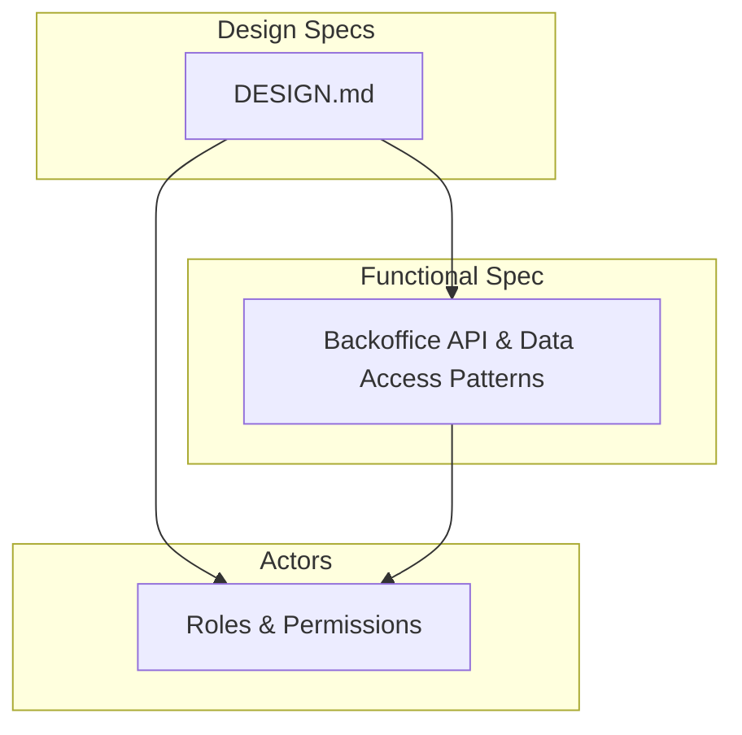
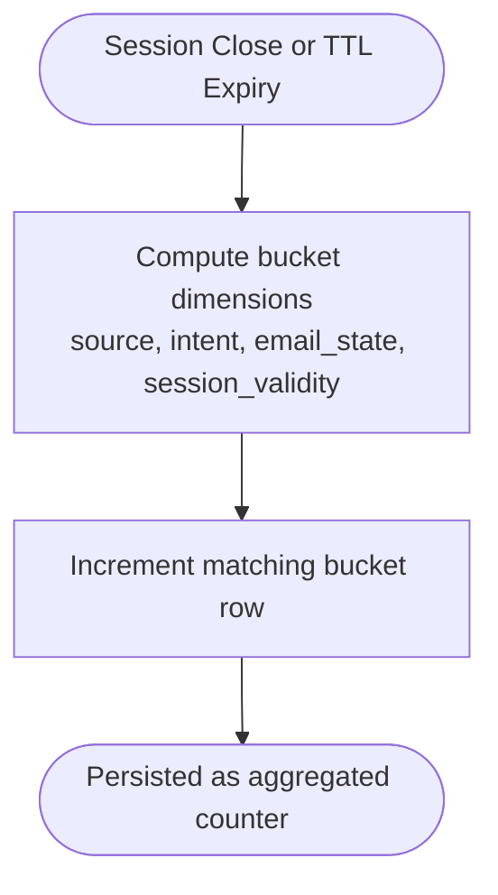
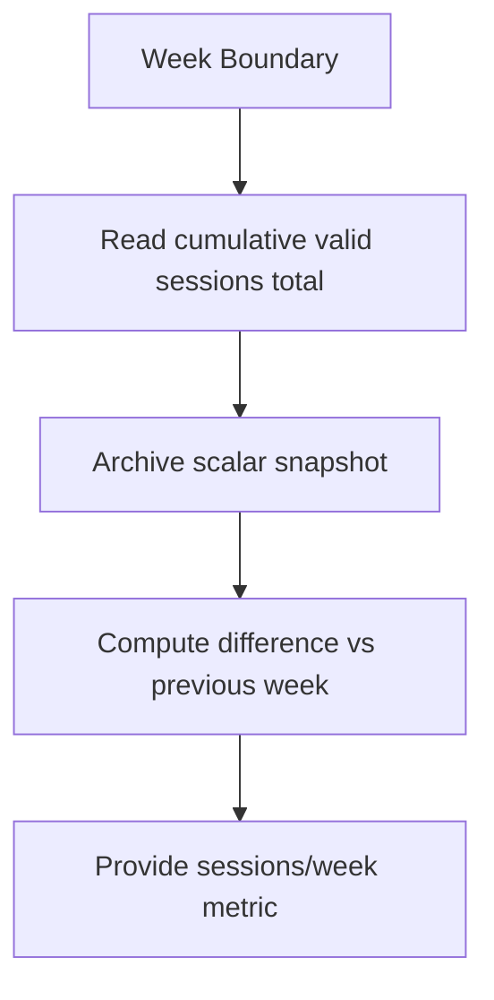
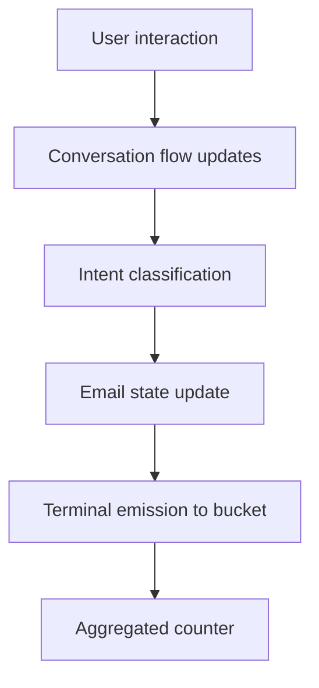
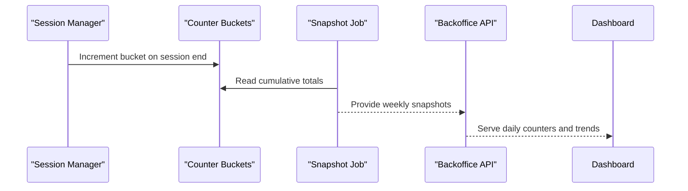
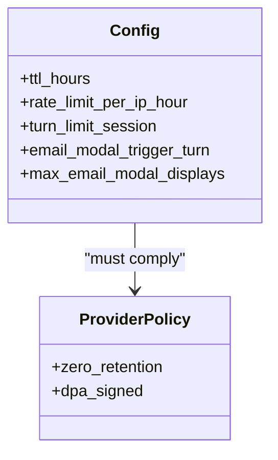
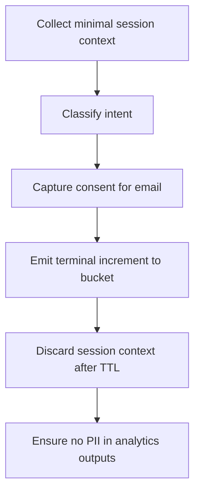
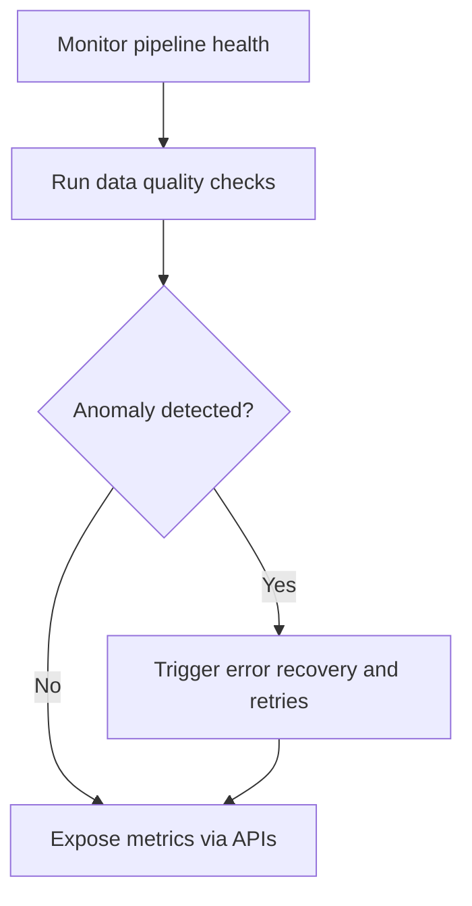
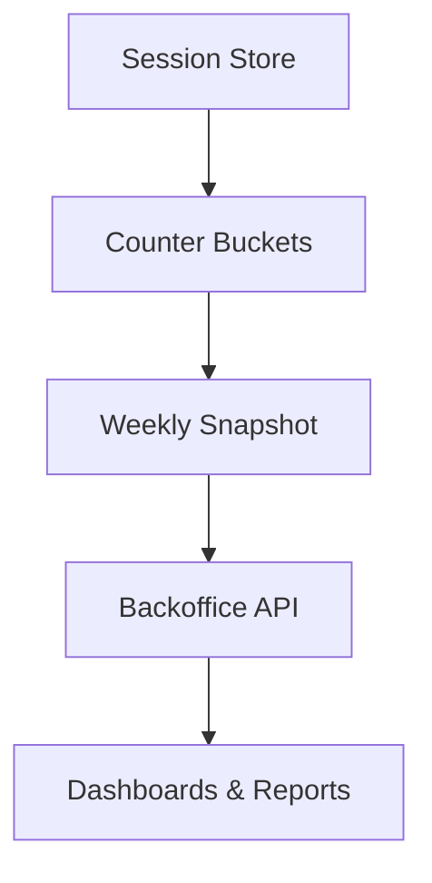

# Analytics Platform Integration

<cite>
**Referenced Files in This Document**
- [DESIGN.md](file://.genie/brainstorms/plataforma-conversa-lead/DESIGN.md)
- [01-actors-and-roles.md](file://docs/sdd/01-actors-and-roles.md)
- [02-user-stories.md](file://docs/sdd/02-user-stories.md)
- [03-functional-spec-backoffice.md](file://docs/sdd/03-functional-spec-backoffice.md)
</cite>

## Table of Contents
1. [Introduction](#introduction)
2. [Project Structure](#project-structure)
3. [Core Components](#core-components)
4. [Architecture Overview](#architecture-overview)
5. [Detailed Component Analysis](#detailed-component-analysis)
6. [Dependency Analysis](#dependency-analysis)
7. [Performance Considerations](#performance-considerations)
8. [Troubleshooting Guide](#troubleshooting-guide)
9. [Conclusion](#conclusion)
10. [Appendices](#appendices)

## Introduction
This document explains the analytics platform integration for the Sup Better Engine, focusing on how anonymized usage metrics are collected, processed, and reported without exposing personally identifiable information (PII). It covers the pre-aggregated counter design, weekly snapshot generation, privacy-preserving analytics approach, event tracking for user interactions and conversion metrics, configuration options, data synchronization patterns, and monitoring/alerting for pipeline health and data quality.

The system is designed to:
- Collect session-level signals during anonymous conversations.
- Emit a single terminal increment per session into a low-cardinality bucket table at session end or TTL expiry.
- Generate weekly scalar snapshots for trend analysis.
- Provide backoffice APIs for daily counters, weekly snapshots, and trends.
- Enforce strict privacy by retaining no session identifiers or timestamps in aggregated outputs.

**Section sources**
- [DESIGN.md:127-165](file://.genie/brainstorms/plataforma-conversa-lead/DESIGN.md#L127-L165)
- [DESIGN.md:198-213](file://.genie/brainstorms/plataforma-conversa-lead/DESIGN.md#L198-L213)
- [03-functional-spec-backoffice.md:306-309](file://docs/sdd/03-functional-spec-backoffice.md#L306-L309)

## Project Structure
The repository contains design and functional specifications that define the analytics behavior:
- Design specification outlines the pre-aggregated counters, weekly snapshots, and privacy constraints.
- Functional specification defines backoffice APIs for counters and snapshots.
- Actor and role model clarifies who consumes analytics and with what permissions.



**Diagram sources**
- [DESIGN.md:127-165](file://.genie/brainstorms/plataforma-conversa-lead/DESIGN.md#L127-L165)
- [03-functional-spec-backoffice.md:306-335](file://docs/sdd/03-functional-spec-backoffice.md#L306-L335)
- [01-actors-and-roles.md:10-30](file://docs/sdd/01-actors-and-roles.md#L10-L30)

**Section sources**
- [DESIGN.md:127-165](file://.genie/brainstorms/plataforma-conversa-lead/DESIGN.md#L127-L165)
- [03-functional-spec-backoffice.md:306-335](file://docs/sdd/03-functional-spec-backoffice.md#L306-L335)
- [01-actors-and-roles.md:10-30](file://docs/sdd/01-actors-and-roles.md#L10-L30)

## Core Components
- Pre-aggregated counter buckets:
  - Dimensions include source, intent, email state, and session validity.
  - Each session emits one terminal increment into a bucket; no session ID or timestamp is stored with the increment.
- Weekly snapshots:
  - A scalar total of valid sessions is archived at week boundaries to compute sessions/week via differences.
- Edge counters:
  - Separate scalars track blocking events by IP and day to avoid mixing units with session-based counters.
- Backoffice APIs:
  - Endpoints expose daily counters, weekly snapshots, and trends for dashboards and reporting.

Key privacy guarantees:
- No PII leaves the system in analytics outputs.
- No per-session identifiers or timestamps persist in aggregated artifacts.
- Session transcripts and ephemeral context are discarded after TTL.

**Section sources**
- [DESIGN.md:127-165](file://.genie/brainstorms/plataforma-conversa-lead/DESIGN.md#L127-L165)
- [DESIGN.md:198-213](file://.genie/brainstorms/plataforma-conversa-lead/DESIGN.md#L198-L213)
- [03-functional-spec-backoffice.md:306-335](file://docs/sdd/03-functional-spec-backoffice.md#L306-L335)

## Architecture Overview
The analytics pipeline consists of:
- Session lifecycle management with TTL enforcement.
- Terminal emission logic that increments pre-aggregated buckets.
- Weekly snapshot job that archives a scalar total.
- Backoffice read layer serving counters and snapshots via APIs.

```mermaid
sequenceDiagram
participant Client as "Client"
participant Agent as "Agent"
participant Session as "Session Store"
participant Counters as "Counter Buckets"
participant Snapshots as "Weekly Snapshot"
participant API as "Backoffice API"
Client->>Agent : Start conversation
Agent->>Session : Create anonymous session
Agent->>Session : Update context per turn
Note over Session : TTL enforced; transcript discarded on expiry
Session-->>Counters : Terminal increment on close/expiry
Counters-->>Snapshots : Aggregate totals at week boundary
API-->>Client : Daily counters / Weekly snapshots / Trends
```

**Diagram sources**
- [DESIGN.md:127-165](file://.genie/brainstorms/plataforma-conversa-lead/DESIGN.md#L127-L165)
- [DESIGN.md:198-213](file://.genie/brainstorms/plataforma-conversa-lead/DESIGN.md#L198-L213)
- [03-functional-spec-backoffice.md:306-335](file://docs/sdd/03-functional-spec-backoffice.md#L306-L335)

## Detailed Component Analysis

### Pre-Aggregated Counter Design
- Bucket dimensions:
  - Source: attribution source plus unknown.
  - Intent: qualification, service, scheduling, sales, undefined, none.
  - Email state: not requested, requested but not sent, sent and rejected, sent and accepted.
  - Session validity: valid, excluded due to rate limit, excluded due to turn limit.
- Emission rule:
  - One terminal increment per session at close or TTL expiry.
  - No session identifier or timestamp attached to the increment.
- Rationale:
  - Avoids correlatable logs and preserves anonymity.
  - Keeps cardinality low and storage efficient.



**Diagram sources**
- [DESIGN.md:127-165](file://.genie/brainstorms/plataforma-conversa-lead/DESIGN.md#L127-L165)

**Section sources**
- [DESIGN.md:127-165](file://.genie/brainstorms/plataforma-conversa-lead/DESIGN.md#L127-L165)

### Weekly Snapshot Generation
- At week boundaries, archive a scalar representing the cumulative total of valid sessions.
- Weekly sessions are derived from differences between consecutive scalars.
- This avoids storing per-bucket weekly slices and prevents rare combinations from becoming event-like records.



**Diagram sources**
- [DESIGN.md:152-158](file://.genie/brainstorms/plataforma-conversa-lead/DESIGN.md#L152-L158)

**Section sources**
- [DESIGN.md:152-158](file://.genie/brainstorms/plataforma-conversa-lead/DESIGN.md#L152-L158)

### Event Tracking System
- User interactions:
  - Tracked implicitly through session lifecycle and terminal emissions; no per-turn event stream is persisted for analytics.
- Conversation flows:
  - Intent classification influences bucket dimension assignment at emission time.
- Conversion metrics:
  - Email state transitions determine conversion outcomes captured in the email state dimension.
- Privacy:
  - No per-event identifiers or timestamps are retained in analytics outputs.



**Diagram sources**
- [DESIGN.md:127-165](file://.genie/brainstorms/plataforma-conversa-lead/DESIGN.md#L127-L165)

**Section sources**
- [DESIGN.md:127-165](file://.genie/brainstorms/plataforma-conversa-lead/DESIGN.md#L127-L165)

### Data Synchronization and Batch Operations
- Synchronization:
  - Counters are updated atomically per terminal emission.
  - Weekly snapshots are computed off the aggregated totals at scheduled boundaries.
- Batch operations:
  - Reads use pre-aggregated bucket tables for fast queries.
  - Backoffice endpoints serve daily counters, weekly snapshots, and trends.



**Diagram sources**
- [03-functional-spec-backoffice.md:306-335](file://docs/sdd/03-functional-spec-backoffice.md#L306-L335)

**Section sources**
- [03-functional-spec-backoffice.md:306-335](file://docs/sdd/03-functional-spec-backoffice.md#L306-L335)

### Configuration Options
- Operational parameters:
  - Session TTL, rate limits, turn limits, email modal trigger turn, max modal displays.
- Provider considerations:
  - LLM provider retention policy must be zero-retention with signed DPA prior to pilot.
- Retention policies:
  - Anonymous session data discarded after TTL; no personal data persists beyond TTL.



**Diagram sources**
- [03-functional-spec-backoffice.md:192-210](file://docs/sdd/03-functional-spec-backoffice.md#L192-L210)
- [DESIGN.md:378-380](file://.genie/brainstorms/plataforma-conversa-lead/DESIGN.md#L378-L380)

**Section sources**
- [03-functional-spec-backoffice.md:192-210](file://docs/sdd/03-functional-spec-backoffice.md#L192-L210)
- [DESIGN.md:378-380](file://.genie/brainstorms/plataforma-conversa-lead/DESIGN.md#L378-L380)

### Privacy Compliance
- No PII in analytics outputs:
  - Aggregations contain only low-cardinality categorical dimensions.
  - No session IDs or timestamps are stored with increments.
- Consent and purpose:
  - Email collection includes explicit consent language limited to commercial follow-up for the conversation.
- Rights handling:
  - Manual runbook for access/deletion requests exists and is exercised before pilot conclusions.



**Diagram sources**
- [DESIGN.md:127-165](file://.genie/brainstorms/plataforma-conversa-lead/DESIGN.md#L127-L165)
- [DESIGN.md:198-213](file://.genie/brainstorms/plataforma-conversa-lead/DESIGN.md#L198-L213)

**Section sources**
- [DESIGN.md:127-165](file://.genie/brainstorms/plataforma-conversa-lead/DESIGN.md#L127-L165)
- [DESIGN.md:198-213](file://.genie/brainstorms/plataforma-conversa-lead/DESIGN.md#L198-L213)

### Monitoring and Alerting
- Pipeline health:
  - Monitor counter ingestion rates and snapshot job execution.
- Data quality checks:
  - Validate bucket dimension distributions and detect anomalies in edge counters.
- Error recovery:
  - Ensure idempotent increments and retry mechanisms for snapshot jobs.
- Observability:
  - Use backoffice APIs to surface daily counters and weekly snapshots for dashboards.



[No sources needed since this section provides general guidance]

## Dependency Analysis
Analytics depends on:
- Session store for lifecycle and TTL enforcement.
- Counter buckets for aggregated storage.
- Snapshot job for weekly aggregation.
- Backoffice API for consumption by dashboards and reports.



**Diagram sources**
- [03-functional-spec-backoffice.md:306-335](file://docs/sdd/03-functional-spec-backoffice.md#L306-L335)

**Section sources**
- [03-functional-spec-backoffice.md:306-335](file://docs/sdd/03-functional-spec-backoffice.md#L306-L335)

## Performance Considerations
- Low cardinality buckets minimize storage and query cost.
- Terminal emission reduces write amplification compared to per-turn event logging.
- Weekly scalar snapshots simplify trend computation and reduce storage overhead.
- Edge counters isolate abuse signals without contaminating session-based metrics.

[No sources needed since this section provides general guidance]

## Troubleshooting Guide
Common issues and mitigations:
- Missing increments:
  - Verify session close/TTL paths and ensure terminal emission triggers.
- Incorrect bucket dimensions:
  - Validate intent classification and email state transitions.
- Snapshot inconsistencies:
  - Check cumulative totals and ensure idempotent archival.
- Rate limiting false positives:
  - Review edge counters and adjust thresholds if necessary.

**Section sources**
- [DESIGN.md:159-165](file://.genie/brainstorms/plataforma-conversa-lead/DESIGN.md#L159-L165)
- [03-functional-spec-backoffice.md:306-335](file://docs/sdd/03-functional-spec-backoffice.md#L306-L335)

## Conclusion
The analytics platform integration emphasizes privacy-first design through pre-aggregated counters and weekly scalar snapshots. By emitting a single terminal increment per session and avoiding per-session identifiers or timestamps, the system ensures anonymized reporting while still providing actionable insights via backoffice APIs. Operational parameters and provider policies support compliance and performance, and monitoring/alerting safeguards pipeline health and data quality.

[No sources needed since this section summarizes without analyzing specific files]

## Appendices

### Metric Definitions and Reporting Formats
- Metrics:
  - Sessions by intent, email state distribution, valid/excluded sessions, sessions/week.
- Reporting formats:
  - Daily counters endpoint returns current-day aggregated buckets.
  - Weekly snapshots endpoint returns scalar series for trend analysis.
  - Trends endpoint provides derived metrics such as sessions/week and conversion rates.

**Section sources**
- [03-functional-spec-backoffice.md:306-309](file://docs/sdd/03-functional-spec-backoffice.md#L306-L309)

### Example Aggregation Queries
- Daily counters:
  - Query aggregated bucket table grouped by dimensions for today’s counts.
- Weekly snapshots:
  - Retrieve scalar totals archived at week boundaries and compute differences.
- Trends:
  - Derive sessions/week and conversion rates from snapshots and lead counts.

[No sources needed since this section provides general guidance]