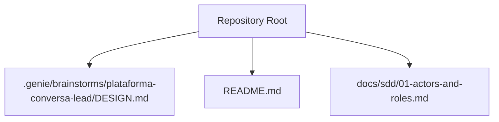
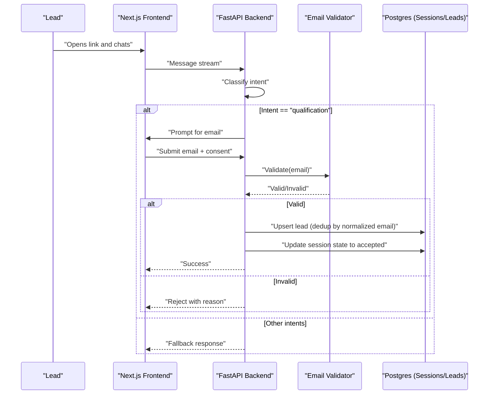
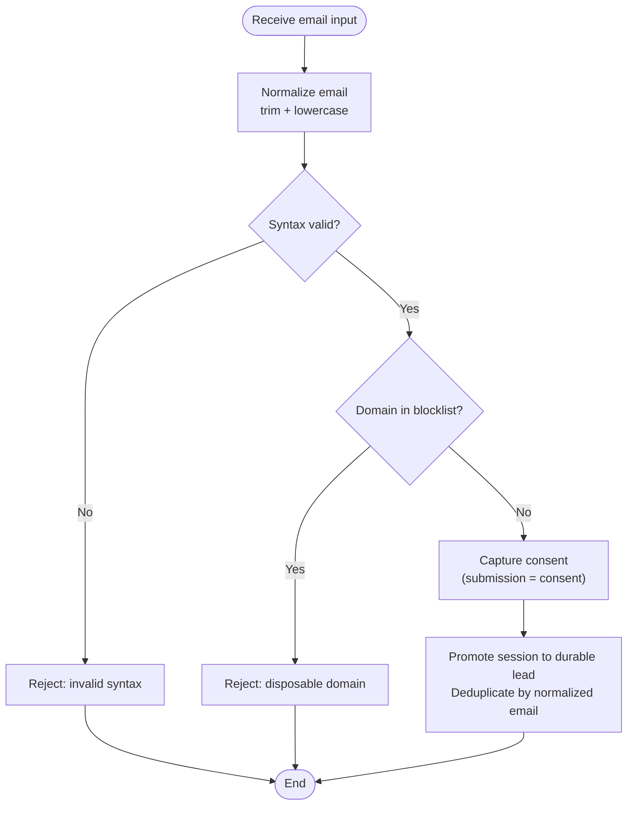
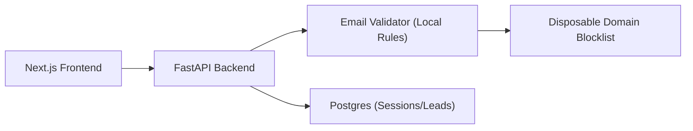

# Email Validation Service

<cite>
**Referenced Files in This Document**
- [DESIGN.md](file://.genie/brainstorms/plataforma-conversa-lead/DESIGN.md)
- [README.md](file://README.md)
</cite>

## Table of Contents
1. [Introduction](#introduction)
2. [Project Structure](#project-structure)
3. [Core Components](#core-components)
4. [Architecture Overview](#architecture-overview)
5. [Detailed Component Analysis](#detailed-component-analysis)
6. [Dependency Analysis](#dependency-analysis)
7. [Performance Considerations](#performance-considerations)
8. [Troubleshooting Guide](#troubleshooting-guide)
9. [Conclusion](#conclusion)
10. [Appendices](#appendices)

## Introduction
This document specifies the email validation service integrated into the lead conversation platform. It covers the end-to-end workflow from syntax checking to disposable domain detection, consent handling, and promotion of anonymous sessions to durable leads. It also documents configuration options for validation rules, blocked domains, and custom logic; request/response patterns; error scenarios; privacy and compliance considerations; performance optimizations such as caching and batch processing; and troubleshooting guidance for common failures and service unavailability.

The email validation is intentionally lightweight for this phase: it validates syntax and rejects known disposable domains via a public blocklist. There is no proof-of-possession (no confirmation code or double opt-in) in this slice. Consent is captured at the moment of submission with a narrow purpose tied to commercial follow-up for the current conversation.

**Section sources**
- [DESIGN.md:47-111](file://.genie/brainstorms/plataforma-conversa-lead/DESIGN.md#L47-L111)
- [DESIGN.md:339-366](file://.genie/brainstorms/plataforma-conversa-lead/DESIGN.md#L339-L366)
- [DESIGN.md:386-398](file://.genie/brainstorms/plataforma-conversa-lead/DESIGN.md#L386-L398)

## Project Structure
At present, the repository contains design documentation and an initial README. The email validation behavior described here is defined by the design specification rather than implemented source code.

**Diagram sources**
- [README.md:1-8](file://README.md#L1-L8)
- [DESIGN.md:1-10](file://.genie/brainstorms/plataforma-conversa-lead/DESIGN.md#L1-L10)

**Section sources**
- [README.md:1-8](file://README.md#L1-L8)

## Core Components
- Syntax validation: Rejects malformed emails before any further processing.
- Disposable domain detection: Uses a public blocklist to reject known disposable domains.
- Consent capture: Submission acts as affirmative consent for the narrow purpose of commercial follow-up on the current conversation.
- Session promotion: On successful validation and consent, the anonymous session is promoted to a durable lead, deduplicated by normalized email (trim + lowercase).
- State tracking: Monotonic email state per session ensures consistent metrics and avoids impossible states.

Key behaviors are constrained by the design:
- No proof-of-possession in this slice.
- Deduplication by normalized email.
- Strict consent semantics: sending is consent; there is no separate “accepted but not sent” state.

**Section sources**
- [DESIGN.md:47-111](file://.genie/brainstorms/plataforma-conversa-lead/DESIGN.md#L47-L111)
- [DESIGN.md:339-366](file://.genie/brainstorms/plataforma-conversa-lead/DESIGN.md#L339-L366)
- [DESIGN.md:386-398](file://.genie/brainstorms/plataforma-conversa-lead/DESIGN.md#L386-L398)

## Architecture Overview
The email validation service integrates into the chat flow triggered by the qualification handler. When conditions are met, the system prompts for email input, validates it locally (syntax + blocklist), captures consent, and promotes the session to a durable lead if valid.

**Diagram sources**
- [DESIGN.md:47-111](file://.genie/brainstorms/plataforma-conversa-lead/DESIGN.md#L47-L111)
- [DESIGN.md:189-213](file://.genie/brainstorms/plataforma-conversa-lead/DESIGN.md#L189-L213)
- [DESIGN.md:339-366](file://.genie/brainstorms/plataforma-conversa-lead/DESIGN.md#L339-L366)

## Detailed Component Analysis

### Email Validation Workflow
The workflow enforces strict validation and consent semantics:

**Diagram sources**
- [DESIGN.md:47-111](file://.genie/brainstorms/plataforma-conversa-lead/DESIGN.md#L47-L111)
- [DESIGN.md:339-366](file://.genie/brainstorms/plataforma-conversa-lead/DESIGN.md#L339-L366)
- [DESIGN.md:386-398](file://.genie/brainstorms/plataforma-conversa-lead/DESIGN.md#L386-L398)

**Section sources**
- [DESIGN.md:47-111](file://.genie/brainstorms/plataforma-conversa-lead/DESIGN.md#L47-L111)
- [DESIGN.md:339-366](file://.genie/brainstorms/plataforma-conversa-lead/DESIGN.md#L339-L366)
- [DESIGN.md:386-398](file://.genie/brainstorms/plataforma-conversa-lead/DESIGN.md#L386-L398)

### Configuration Options
- Validation rules:
  - Syntax enforcement must be applied before any external calls.
  - Public blocklist of disposable domains must be consulted; entries can be updated without redeploy.
- Blocked domains:
  - Maintain a curated list of disposable domains; ensure it is synchronized across services.
- Custom validation logic:
  - Extend local checks (e.g., tenant-specific policies) while preserving the monotonic state model and consent semantics.
- Operational parameters:
  - Session TTL: 24 hours.
  - Rate limiting: 30 messages per IP per hour.
  - Message cap per session: based on tenant’s historical longest conversation or a default ceiling.
  - Pilot window: 12 weeks.

These parameters influence when and how often the email prompt appears and how long anonymous sessions persist.

**Section sources**
- [DESIGN.md:47-111](file://.genie/brainstorms/plataforma-conversa-lead/DESIGN.md#L47-L111)
- [DESIGN.md:117-126](file://.genie/brainstorms/plataforma-conversa-lead/DESIGN.md#L117-L126)
- [DESIGN.md:339-366](file://.genie/brainstorms/plataforma-conversa-lead/DESIGN.md#L339-L366)

### Request and Response Handling
- Input:
  - Email string provided by the user in the identification modal.
  - Implicit consent upon submission.
- Processing:
  - Normalize email (trim + lowercase).
  - Validate syntax.
  - Check against disposable domain blocklist.
  - If valid, promote session to a durable lead with consent recorded.
- Output:
  - Success: lead created or merged; session state advanced to accepted.
  - Failure: rejection with reason (invalid syntax or disposable domain); session state remains or advances to rejected depending on attempt history.

Metrics track terminal email state per session to ensure consistency between metrics and stored data.

**Section sources**
- [DESIGN.md:47-111](file://.genie/brainstorms/plataforma-conversa-lead/DESIGN.md#L47-L111)
- [DESIGN.md:339-366](file://.genie/brainstorms/plataforma-conversa-lead/DESIGN.md#L339-L366)
- [DESIGN.md:386-398](file://.genie/brainstorms/plataforma-conversa-lead/DESIGN.md#L386-L398)

### Error Scenarios
- Invalid syntax: immediate rejection; user can correct and resubmit within the same attempt.
- Disposable domain: immediate rejection; user can resubmit with a different address.
- Repeated rejections: session records terminal state as rejected until a successful submission occurs.
- Service constraints: rate limits and message caps may affect availability of the chat endpoint; email validation runs locally and is not impacted by LLM provider status.

**Section sources**
- [DESIGN.md:386-398](file://.genie/brainstorms/plataforma-conversa-lead/DESIGN.md#L386-L398)
- [DESIGN.md:112-126](file://.genie/brainstorms/plataforma-conversa-lead/DESIGN.md#L112-L126)

## Dependency Analysis
The email validation depends on:
- Local validation rules (syntax and blocklist).
- Consent capture mechanism.
- Data store for ephemeral sessions and durable leads.
- Optional future integrations (external validation APIs) are out of scope for this slice.

**Diagram sources**
- [DESIGN.md:189-213](file://.genie/brainstorms/plataforma-conversa-lead/DESIGN.md#L189-L213)
- [DESIGN.md:339-366](file://.genie/brainstorms/plataforma-conversa-lead/DESIGN.md#L339-L366)

**Section sources**
- [DESIGN.md:189-213](file://.genie/brainstorms/plataforma-conversa-lead/DESIGN.md#L189-L213)
- [DESIGN.md:339-366](file://.genie/brainstorms/plataforma-conversa-lead/DESIGN.md#L339-L366)

## Performance Considerations
- Caching validated emails:
  - Cache normalized email results (valid/invalid) with short TTL to reduce repeated validations during retries within a session.
  - Ensure cache keys include tenant context if multi-tenant is introduced later.
- Batch processing:
  - For bulk imports or backfills, normalize and validate in batches; apply deduplication and consent recording consistently.
- Rate limiting and caps:
  - Respect 30 messages per IP per hour and per-session message caps to protect backend resources.
- Storage efficiency:
  - Use monotonic email state to avoid redundant updates and maintain consistent metrics.

[No sources needed since this section provides general guidance]

## Troubleshooting Guide
Common issues and resolutions:
- Persistent syntax errors:
  - Verify normalization steps (trim + lowercase) and ensure UI enforces formatting hints.
- Frequent disposable domain rejections:
  - Review blocklist coverage; consider adding new domains as they emerge.
- Inconsistent metrics vs. stored leads:
  - Confirm monotonic state progression and that promotions only occur on valid submissions with consent recorded.
- Service unavailability:
  - Since validation is local, frontend should handle transient network issues gracefully; retry with exponential backoff for backend calls.
- Excessive retries:
  - Enforce maximum attempts per session and provide clear feedback to users.

**Section sources**
- [DESIGN.md:386-398](file://.genie/brainstorms/plataforma-conversa-lead/DESIGN.md#L386-L398)
- [DESIGN.md:112-126](file://.genie/brainstorms/plataforma-conversa-lead/DESIGN.md#L112-L126)

## Conclusion
The email validation service for this slice focuses on robust local validation (syntax and disposable domain blocklist), explicit consent capture, and safe promotion of anonymous sessions to durable leads with deduplication. It avoids proof-of-possession to minimize friction and preserve the metric under test. Privacy and compliance are addressed through narrow-purpose consent, minimal retention of anonymous sessions, and documented processes for data subject rights. Performance is optimized via caching and batch capabilities, while operational safeguards like rate limiting protect the system.

[No sources needed since this section summarizes without analyzing specific files]

## Appendices

### Privacy and Compliance Notes
- Narrow purpose: consent is limited to commercial follow-up for the current conversation; marketing consent is handled elsewhere.
- Retention: anonymous sessions are discarded after TTL; durable leads persist with recorded consent and purpose.
- Rights: manual runbook exists for access and deletion requests per applicable regulations.

**Section sources**
- [DESIGN.md:47-111](file://.genie/brainstorms/plataforma-conversa-lead/DESIGN.md#L47-L111)
- [DESIGN.md:339-366](file://.genie/brainstorms/plataforma-conversa-lead/DESIGN.md#L339-L366)