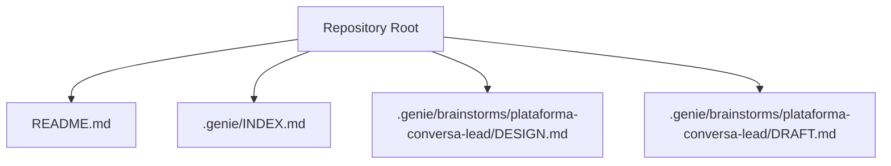
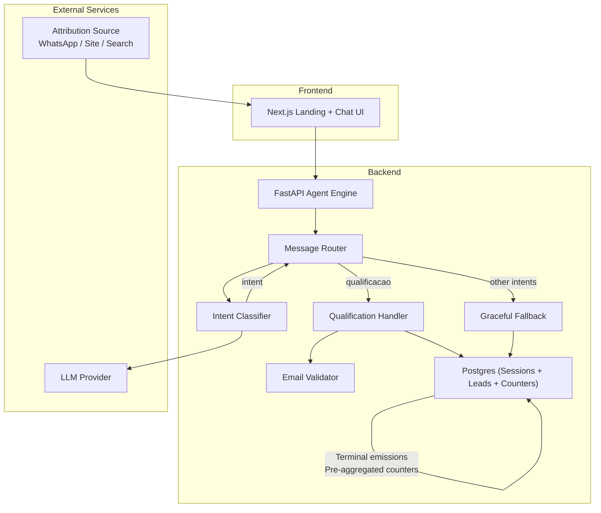
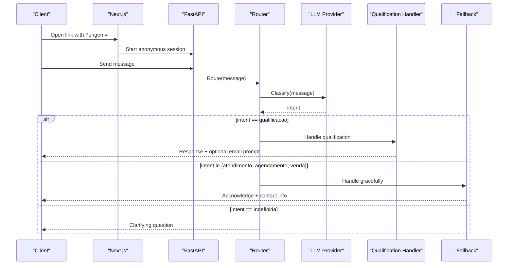
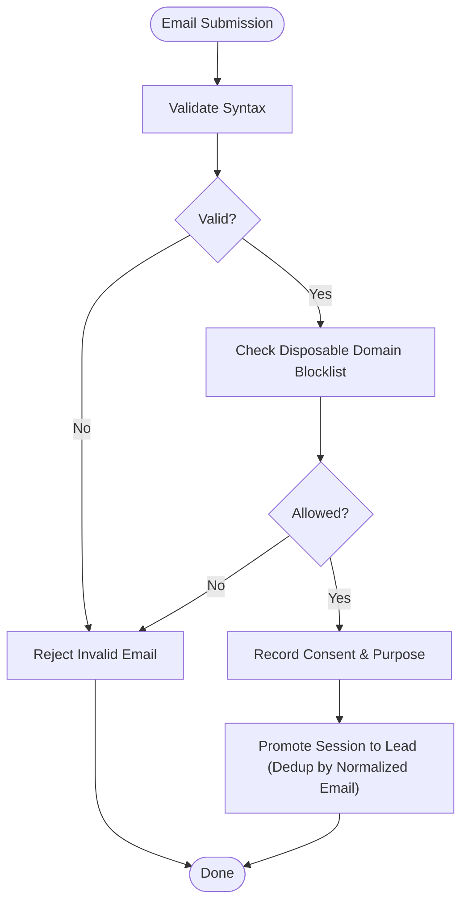
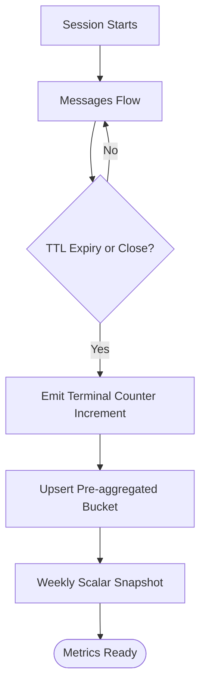
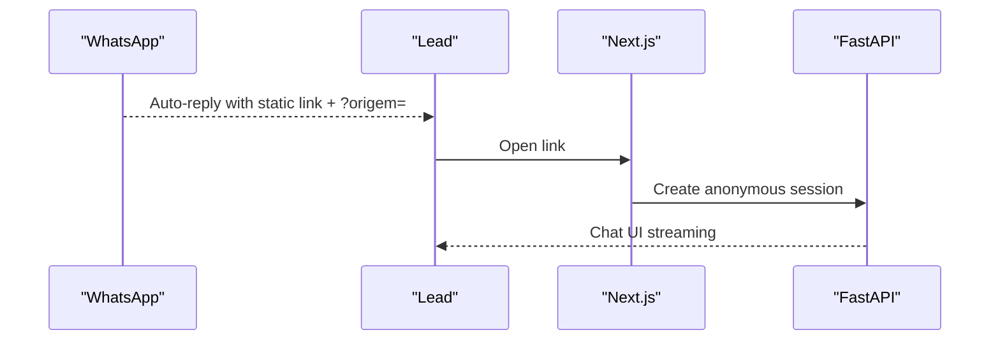
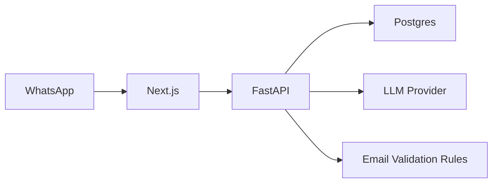

# Integration Patterns

<cite>
**Referenced Files in This Document**
- [README.md](file://README.md)
- [INDEX.md](file://.genie/INDEX.md)
- [DESIGN.md](file://.genie/brainstorms/plataforma-conversa-lead/DESIGN.md)
- [DRAFT.md](file://.genie/brainstorms/plataforma-conversa-lead/DRAFT.md)
</cite>

## Table of Contents
1. Introduction
2. Project Structure
3. Core Components
4. Architecture Overview
5. Detailed Component Analysis
6. Dependency Analysis
7. Performance Considerations
8. Troubleshooting Guide
9. Conclusion

## Introduction
This document describes the integration patterns for the Sup Better Engine as defined by the project’s design artifacts. It focuses on how the system integrates with external services such as LLM providers, email validation, and analytics platforms; how WhatsApp is used as an entry point via link generation and attribution; and what security, rate limiting, and monitoring strategies are in place. The content is derived from the repository’s design documents and initial project notes.

## Project Structure
The repository currently contains planning and design materials rather than implementation code. The key artifacts are:
- A top-level README indicating the project is in its early stage.
- A plans index that points to a ready design for the lead conversation platform.
- A detailed design document specifying scope, decisions, risks, success criteria, and operational parameters.
- A draft summarizing decisions and open items.

**Section sources**
- [README.md:1-8](file://README.md#L1-L8)
- [INDEX.md:1-12](file://.genie/INDEX.md#L1-L12)

## Core Components
Based on the design, the system integrates with several external components and enforces specific patterns:

- LLM provider integration
  - Purpose: Intent classification and agent responses during chat sessions.
  - Pattern: Public endpoint protection via rate limiting per IP and per-session message caps; explicit retention policy requirements (zero retention and signed DPA before pilot).
  - Fallback behavior: When intent is not one of the handled categories, a graceful fallback responds without invoking the real handler.

- Email validation service
  - Purpose: Validate user-provided emails at identification time.
  - Pattern: Syntax check plus blocklist of disposable domains; no confirmation code or ownership verification in this slice.
  - Consent gating: Sending the email is the consent act; marketing consent is out of scope for this slice.

- Analytics and counters
  - Purpose: Measure engagement, conversion, and session validity without retaining PII or session identifiers.
  - Pattern: Terminal emission per session that increments pre-aggregated buckets across four dimensions (origin, intent, email state, session validity). Weekly scalar snapshot of total valid sessions outside the bucket.

- WhatsApp integration pattern
  - Purpose: Drive traffic to the platform using a static link sent via WhatsApp auto-reply.
  - Pattern: No bidirectional API sync in this slice; attribution via URL query parameter; leads arrive anonymously regardless of source.

**Section sources**
- [DESIGN.md:51-127](file://.genie/brainstorms/plataforma-conversa-lead/DESIGN.md#L51-L127)
- [DESIGN.md:127-165](file://.genie/brainstorms/plataforma-conversa-lead/DESIGN.md#L127-L165)
- [DESIGN.md:345-360](file://.genie/brainstorms/plataforma-conversa-lead/DESIGN.md#L345-L360)
- [DESIGN.md:371-383](file://.genie/brainstorms/plataforma-conversa-lead/DESIGN.md#L371-L383)

## Architecture Overview
High-level architecture and integration boundaries as designed:

**Diagram sources**
- [DESIGN.md:191-213](file://.genie/brainstorms/plataforma-conversa-lead/DESIGN.md#L191-L213)
- [DESIGN.md:51-127](file://.genie/brainstorms/plataforma-conversa-lead/DESIGN.md#L51-L127)
- [DESIGN.md:127-165](file://.genie/brainstorms/plataforma-conversa-lead/DESIGN.md#L127-L165)

## Detailed Component Analysis

### LLM Provider Integration
- Integration strategy
  - Use a classifier component with a clear interface: message → intent.
  - Protect the public LLM endpoint with rate limiting per IP and per-session message caps.
  - Enforce zero-retention policy and sign a Data Processing Agreement prior to pilot use.
- Retry and resilience
  - The design specifies rate limiting and terminal emissions but does not define retry/backoff or circuit breaker logic for LLM calls. Implementations should add robust retries with exponential backoff and circuit breaking to avoid cascading failures.
- Fallback handling
  - If intent falls into non-handled categories, route to a graceful fallback that acknowledges the request and directs to tenant contact without invoking the qualification handler.

**Diagram sources**
- [DESIGN.md:51-85](file://.genie/brainstorms/plataforma-conversa-lead/DESIGN.md#L51-L85)
- [DESIGN.md:191-213](file://.genie/brainstorms/plataforma-conversa-lead/DESIGN.md#L191-L213)

**Section sources**
- [DESIGN.md:51-85](file://.genie/brainstorms/plataforma-conversa-lead/DESIGN.md#L51-L85)
- [DESIGN.md:191-213](file://.genie/brainstorms/plataforma-conversa-lead/DESIGN.md#L191-L213)
- [DESIGN.md:371-383](file://.genie/brainstorms/plataforma-conversa-lead/DESIGN.md#L371-L383)

### Email Validation Integration
- Integration strategy
  - Validate syntax and reject disposable domains via a blocklist.
  - Do not send confirmation codes in this slice; keep friction low while protecting metrics.
- Consent gating
  - Sending the email is the consent act for commercial return about this conversation; marketing consent is collected elsewhere.
- Deduplication
  - Normalize email (trim + lowercase) to deduplicate leads.

**Diagram sources**
- [DESIGN.md:86-108](file://.genie/brainstorms/plataforma-conversa-lead/DESIGN.md#L86-L108)
- [DESIGN.md:347-355](file://.genie/brainstorms/plataforma-conversa-lead/DESIGN.md#L347-L355)

**Section sources**
- [DESIGN.md:86-108](file://.genie/brainstorms/plataforma-conversa-lead/DESIGN.md#L86-L108)
- [DESIGN.md:347-355](file://.genie/brainstorms/plataforma-conversa-lead/DESIGN.md#L347-L355)

### Analytics and Counters Integration
- Integration strategy
  - Emit a single terminal event per session upon closure or TTL expiry.
  - Persist only pre-aggregated counters across four categorical dimensions; no session IDs or timestamps per session.
  - Maintain a weekly scalar snapshot of total valid sessions outside the bucket.
- Dimensions
  - Origin (including unknown), intent (including undefined and none), email state (monotonic progression), session validity (valid, excluded by rate limit, excluded by cap).
- Monitoring approach
  - Track blocked requests at the edge as scalars per IP per day for auditability without inflating session counts.

**Diagram sources**
- [DESIGN.md:127-165](file://.genie/brainstorms/plataforma-conversa-lead/DESIGN.md#L127-L165)
- [DESIGN.md:386-398](file://.genie/brainstorms/plataforma-conversa-lead/DESIGN.md#L386-L398)

**Section sources**
- [DESIGN.md:127-165](file://.genie/brainstorms/plataforma-conversa-lead/DESIGN.md#L127-L165)
- [DESIGN.md:386-398](file://.genie/brainstorms/plataforma-conversa-lead/DESIGN.md#L386-L398)

### WhatsApp Integration Pattern (Link Generation and Attribution)
- Strategy
  - WhatsApp acts as an entry point, not a channel: auto-reply sends a static link.
  - No bidirectional API synchronization in this slice.
  - Attribution via URL query parameter; all leads arrive anonymously.
- Implications
  - Simplifies integration surface and avoids costly state sync between WhatsApp and the platform.
  - Enables measurement of link opening rates against declared WhatsApp sends.

**Diagram sources**
- [DESIGN.md:345-347](file://.genie/brainstorms/plataforma-conversa-lead/DESIGN.md#L345-L347)
- [DESIGN.md:47-53](file://.genie/brainstorms/plataforma-conversa-lead/DESIGN.md#L47-L53)

**Section sources**
- [DESIGN.md:47-53](file://.genie/brainstorms/plataforma-conversa-lead/DESIGN.md#L47-L53)
- [DESIGN.md:345-347](file://.genie/brainstorms/plataforma-conversa-lead/DESIGN.md#L345-L347)

## Dependency Analysis
Key dependencies and their roles:
- Next.js frontend depends on FastAPI backend for session management, routing, and data persistence.
- Backend depends on:
  - LLM provider for intent classification and agent responses.
  - Postgres for ephemeral sessions, durable leads, and aggregated counters.
  - External email validation rules (syntax and blocklist).
- WhatsApp dependency is minimal: provides traffic via static links and declared send counts for attribution.

**Diagram sources**
- [DESIGN.md:191-213](file://.genie/brainstorms/plataforma-conversa-lead/DESIGN.md#L191-L213)
- [DESIGN.md:345-347](file://.genie/brainstorms/plataforma-conversa-lead/DESIGN.md#L345-L347)

**Section sources**
- [DESIGN.md:191-213](file://.genie/brainstorms/plataforma-conversa-lead/DESIGN.md#L191-L213)
- [DESIGN.md:345-347](file://.genie/brainstorms/plataforma-conversa-lead/DESIGN.md#L345-L347)

## Performance Considerations
- Rate limiting
  - Per IP: messages per hour to protect the LLM endpoint.
  - Per session: message cap based on the tenant’s longest legitimate WhatsApp conversation; default ceiling if corpus not authorized.
- TTL and cleanup
  - Ephemeral sessions expire after a fixed TTL; terminal emissions ensure metrics remain accurate even when sessions are discarded.
- Aggregation strategy
  - Pre-aggregated counters reduce storage and privacy risk; weekly scalar snapshots simplify trend analysis.
- Observability
  - Edge blocks tracked as scalars per IP per day for auditability without distorting session metrics.

[No sources needed since this section provides general guidance]

## Troubleshooting Guide
Common issues and mitigations aligned with the design:
- LLM endpoint abuse or cost spikes
  - Mitigation: Enforce per-IP and per-session limits; monitor LLM costs as a reconsideration trigger.
- Misclassification leading to wrong handler
  - Mitigation: Validate classifier performance; monitor fallback rate as a drift signal.
- Disposable or invalid emails
  - Mitigation: Syntax checks and disposable domain blocklist; track rejection states for conversion metrics.
- Overly long conversations hitting caps
  - Mitigation: Cap dimensioned from tenant history; count exclusions separately to avoid biasing conversion metrics.
- Privacy and retention concerns
  - Mitigation: Zero-retention policy with signed DPA before pilot; discard anonymous sessions at TTL.

**Section sources**
- [DESIGN.md:112-127](file://.genie/brainstorms/plataforma-conversa-lead/DESIGN.md#L112-L127)
- [DESIGN.md:371-383](file://.genie/brainstorms/plataforma-conversa-lead/DESIGN.md#L371-L383)
- [DESIGN.md:386-398](file://.genie/brainstorms/plataforma-conversa-lead/DESIGN.md#L386-L398)

## Conclusion
The Sup Better Engine’s integration patterns emphasize simplicity, privacy, and measurable outcomes:
- LLM integration is guarded by strict rate limits and retention policies.
- Email validation balances friction and quality through syntax and blocklist checks, with consent as the sending gate.
- Analytics rely on terminal emissions and pre-aggregated counters to preserve privacy while enabling robust measurement.
- WhatsApp serves as a lightweight entry point via static links and attribution parameters, avoiding complex synchronization.
Security, rate limiting, and monitoring are explicitly designed into the flow to protect both users and the system.

[No sources needed since this section summarizes without analyzing specific files]