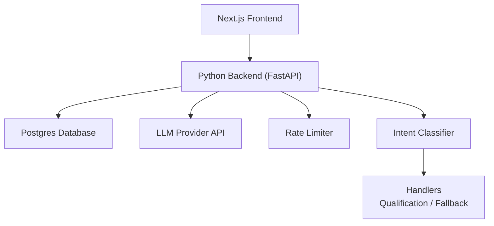
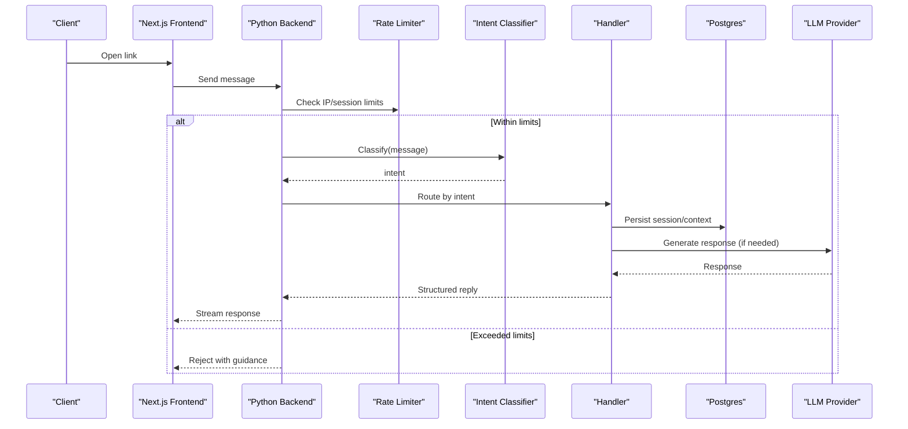
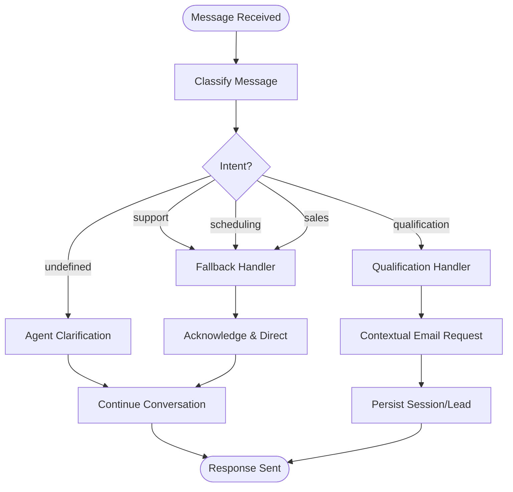
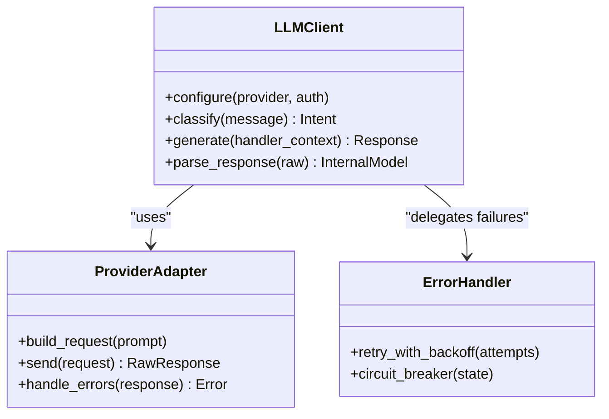
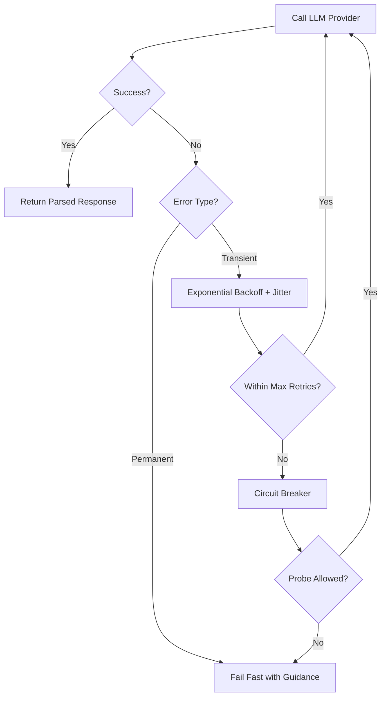
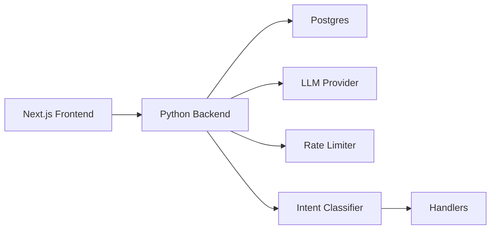

# LLM Provider Integration

<cite>
**Referenced Files in This Document**
- [README.md](file://README.md)
- [INDEX.md](file://.genie/INDEX.md)
- [DESIGN.md](file://.genie/brainstorms/plataforma-conversa-lead/DESIGN.md)
- [DRAFT.md](file://.genie/brainstorms/plataforma-conversa-lead/DRAFT.md)
</cite>

## Table of Contents
1. [Introduction](#introduction)
2. [Project Structure](#project-structure)
3. [Core Components](#core-components)
4. [Architecture Overview](#architecture-overview)
5. [Detailed Component Analysis](#detailed-component-analysis)
6. [Dependency Analysis](#dependency-analysis)
7. [Performance Considerations](#performance-considerations)
8. [Troubleshooting Guide](#troubleshooting-guide)
9. [Conclusion](#conclusion)
10. [Appendices](#appendices)

## Introduction
This document describes how the Sup Better Engine integrates with external Large Language Model (LLM) providers to perform natural language understanding and intent classification for a lead conversation platform. It focuses on the design-level requirements, configuration options, error handling, retry strategies, security considerations, and performance optimizations that will govern the implementation. The project is currently in its early stages; this guide synthesizes the authoritative design documents into an actionable integration blueprint.

Key responsibilities:
- Classify incoming messages into intents: qualification, support, scheduling, sales, or undefined (abstention).
- Route each message to the appropriate handler based on the current message’s intent.
- Protect public endpoints from abuse via rate limiting and per-session message caps.
- Ensure privacy and compliance by minimizing PII exposure and enforcing retention policies.

**Section sources**
- [DESIGN.md:47-166](file://.genie/brainstorms/plataforma-conversa-lead/DESIGN.md#L47-L166)
- [DESIGN.md:254-337](file://.genie/brainstorms/plataforma-conversa-lead/DESIGN.md#L254-L337)
- [DESIGN.md:368-440](file://.genie/brainstorms/plataforma-conversa-lead/DESIGN.md#L368-L440)

## Project Structure
The repository contains design artifacts and planning materials rather than source code at this stage. The structure centers around a design-driven approach for a lead conversation platform using Next.js frontend and a Python backend (FastAPI), with Postgres as the data store.

[No sources needed since this diagram shows conceptual workflow, not actual code structure]

**Section sources**
- [DESIGN.md:191-203](file://.genie/brainstorms/plataforma-conversa-lead/DESIGN.md#L191-L203)
- [DESIGN.md:254-291](file://.genie/brainstorms/plataforma-conversa-lead/DESIGN.md#L254-L291)

## Core Components
- Intent Classifier: A single-purpose unit that maps a message to one of five intents, including an explicit abstention label for greetings or non-intentful input.
- Router: Per-message routing that selects the handler based on the current message’s intent.
- Handlers:
  - Qualification handler: captures intent, urgency, fit, and triggers contextual email request.
  - Fallback handler: gracefully acknowledges other intents and directs to tenant contact without pretending capability.
- Rate Limiting: Enforces IP-based limits and per-session message caps to protect the public LLM endpoint.
- Session Management: Anonymous sessions stored in Postgres with TTL; promoted to durable leads upon consented email submission.
- Aggregated Counters: Terminal emissions increment pre-aggregated buckets for analytics without retaining session identifiers.

Configuration highlights:
- Session TTL: 24 hours.
- Rate limit: 30 messages per IP per hour.
- Per-session message cap: derived from tenant’s historical longest conversation; default fallback if corpus unavailable.
- Pilot window: 12 weeks.

**Section sources**
- [DESIGN.md:51-85](file://.genie/brainstorms/plataforma-conversa-lead/DESIGN.md#L51-L85)
- [DESIGN.md:112-126](file://.genie/brainstorms/plataforma-conversa-lead/DESIGN.md#L112-L126)
- [DESIGN.md:191-203](file://.genie/brainstorms/plataforma-conversa-lead/DESIGN.md#L191-L203)
- [DESIGN.md:254-291](file://.genie/brainstorms/plataforma-conversa-lead/DESIGN.md#L254-L291)

## Architecture Overview
The system uses a layered architecture where the frontend serves the chat interface and the backend orchestrates classification, routing, and provider calls.

**Diagram sources**
- [DESIGN.md:51-85](file://.genie/brainstorms/plataforma-conversa-lead/DESIGN.md#L51-L85)
- [DESIGN.md:112-126](file://.genie/brainstorms/plataforma-conversa-lead/DESIGN.md#L112-L126)
- [DESIGN.md:191-203](file://.genie/brainstorms/plataforma-conversa-lead/DESIGN.md#L191-L203)

## Detailed Component Analysis

### Intent Classification and Routing
- Input: user message within an anonymous session.
- Output: intent ∈ {qualification, support, scheduling, sales, undefined}.
- Routing:
  - qualification → real handler (captures details, prompts for email contextually).
  - support/scheduling/sales → graceful fallback (acknowledge, direct to tenant contact).
  - undefined → agent asks clarifying question (no handler invoked).
- Measurement rule: session inherits the first non-undefined intent for counters; behavior remains per-message.

**Diagram sources**
- [DESIGN.md:51-85](file://.genie/brainstorms/plataforma-conversa-lead/DESIGN.md#L51-L85)
- [DESIGN.md:254-291](file://.genie/brainstorms/plataforma-conversa-lead/DESIGN.md#L254-L291)

**Section sources**
- [DESIGN.md:51-85](file://.genie/brainstorms/plataforma-conversa-lead/DESIGN.md#L51-L85)
- [DESIGN.md:254-291](file://.genie/brainstorms/plataforma-conversa-lead/DESIGN.md#L254-L291)

### LLM Provider Integration Design
- Purpose: Provide natural language understanding and generate responses when required by handlers.
- Client responsibilities:
  - Construct requests with sanitized inputs and structured prompts tailored to intent classification and response generation.
  - Handle provider-specific authentication (e.g., API keys) via secure configuration.
  - Parse provider responses into internal models for routing and handler execution.
- Configuration options:
  - Provider selection (e.g., OpenAI, Anthropic, local models).
  - Authentication method (API key, bearer token).
  - Rate limiting strategy aligned with provider quotas and system caps.
  - Timeout and retry parameters tuned to provider SLAs.
- Security:
  - Do not send raw PII unless necessary; prefer anonymized or masked inputs.
  - Enforce retention policy: ensure provider has zero-retention policy and signed DPA prior to pilot.

[No sources needed since this diagram shows conceptual component relationships, not mapped to specific files]

**Section sources**
- [DESIGN.md:191-203](file://.genie/brainstorms/plataforma-conversa-lead/DESIGN.md#L191-L203)
- [DESIGN.md:368-440](file://.genie/brainstorms/plataforma-conversa-lead/DESIGN.md#L368-L440)

### Prompt Engineering for Intent Classification
- Goal: Produce robust, testable classification with explicit abstention for non-intentful messages.
- Strategy:
  - Use concise instructions defining the five labels and examples of abstention.
  - Include guardrails to avoid forcing a label on greetings or vague inputs.
  - Validate outputs against a labeled dataset with thresholds (≥85% accuracy on real intents; ≤15% misclassification of abstention cases).
- Evaluation:
  - Maintain a labeled corpus (real or synthetic if tenant authorization is unavailable).
  - Track drift via production fallback rates and periodic revalidation.

**Section sources**
- [DESIGN.md:51-85](file://.genie/brainstorms/plataforma-conversa-lead/DESIGN.md#L51-L85)
- [DESIGN.md:386-398](file://.genie/brainstorms/plataforma-conversa-lead/DESIGN.md#L386-L398)

### Response Parsing and Confidence Scoring
- Parsing:
  - Normalize provider responses into a consistent internal schema.
  - Extract confidence scores where available; otherwise infer from model metadata or calibration.
- Confidence usage:
  - Gate actions requiring high certainty (e.g., triggering email request only after sufficient confidence in qualification).
  - Log confidence distributions for monitoring and model improvement.

[No sources needed since this section provides general guidance grounded in design goals]

### Error Handling, Retry, and Circuit Breaker
- Error handling patterns:
  - Distinguish transient errors (network timeouts, rate limits) from permanent errors (invalid credentials, malformed payloads).
  - Return user-friendly messages while logging detailed diagnostics.
- Retry with exponential backoff:
  - Apply bounded retries with jitter for transient failures.
  - Respect provider rate limits and backoff headers.
- Circuit breaker:
  - Open circuit after repeated failures to prevent cascading load.
  - Gradually allow probes to recover; close circuit on success.

[No sources needed since this diagram shows conceptual error flow, not mapped to specific files]

**Section sources**
- [DESIGN.md:368-440](file://.genie/brainstorms/plataforma-conversa-lead/DESIGN.md#L368-L440)

### Security Considerations
- API key management:
  - Store secrets in secure configuration stores; never hardcode.
  - Rotate keys regularly; restrict scope to minimal permissions.
- Input sanitization:
  - Strip or mask PII before sending to providers.
  - Validate and normalize inputs to reduce injection risks.
- Output validation:
  - Validate structured outputs against schemas.
  - Sanitize text responses before rendering to clients.
- Retention and compliance:
  - Require provider zero-retention policy and signed Data Processing Agreement (DPA) before pilot.
  - Enforce session TTL and discard transcripts post-TTL.

**Section sources**
- [DESIGN.md:368-440](file://.genie/brainstorms/plataforma-conversa-lead/DESIGN.md#L368-L440)

## Dependency Analysis
High-level dependencies among components:
- Frontend depends on backend for chat streaming and identification flows.
- Backend depends on:
  - Postgres for session state and aggregated counters.
  - LLM provider for classification and response generation.
  - Rate limiter to protect endpoints.
  - Intent classifier module to route messages deterministically.

[No sources needed since this diagram shows conceptual dependencies, not mapped to specific files]

**Section sources**
- [DESIGN.md:191-203](file://.genie/brainstorms/plataforma-conversa-lead/DESIGN.md#L191-L203)
- [DESIGN.md:254-291](file://.genie/brainstorms/plataforma-conversa-lead/DESIGN.md#L254-L291)

## Performance Considerations
- Request batching:
  - Batch classification requests when feasible to reduce overhead.
  - Group non-critical updates (e.g., counter increments) asynchronously.
- Caching strategies:
  - Cache frequent prompts or template renderings.
  - Cache provider metadata (rate limits, quotas) to optimize retries.
- Timeouts and concurrency:
  - Set strict timeouts per provider call; tune based on observed latency.
  - Limit concurrent requests to respect provider quotas and system capacity.
- Monitoring:
  - Track fallback rates, classification accuracy, and provider error rates.
  - Alert on sustained circuit breaker openings or elevated latency.

[No sources needed since this section provides general guidance]

## Troubleshooting Guide
Common issues and mitigations:
- Provider errors:
  - Transient: apply retry with backoff; monitor circuit breaker state.
  - Permanent: fail fast, log diagnostics, surface user-friendly guidance.
- Rate limiting:
  - Enforce IP and per-session caps; log exclusions separately for auditability.
- Misclassification:
  - Monitor fallback rates; revalidate classifier against labeled corpus.
  - Adjust prompts and thresholds based on drift signals.
- Privacy violations:
  - Audit logs for PII leakage; enforce masking at entry points.
  - Verify provider retention policies and DPA compliance.

**Section sources**
- [DESIGN.md:368-440](file://.genie/brainstorms/plataforma-conversa-lead/DESIGN.md#L368-L440)

## Conclusion
The Sup Better Engine’s LLM integration is designed around a clear separation of concerns: classification, routing, handler orchestration, and provider interaction. The design emphasizes privacy, resilience, and measurable outcomes. While implementation code is not yet present, this blueprint defines the configuration, error handling, security, and performance practices required to build a robust, compliant, and efficient integration.

[No sources needed since this section summarizes without analyzing specific files]

## Appendices
- Project status: Early-stage repository with design documentation guiding future implementation.
- Planning index: Links to brainstorm artifacts and design decisions.

**Section sources**
- [README.md:1-8](file://README.md#L1-L8)
- [INDEX.md:1-10](file://.genie/INDEX.md#L1-L10)
- [DRAFT.md:1-171](file://.genie/brainstorms/plataforma-conversa-lead/DRAFT.md#L1-L171)