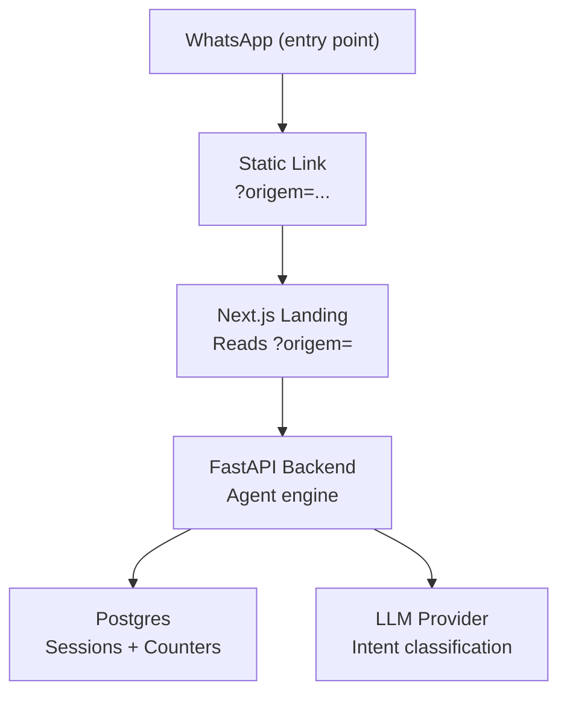
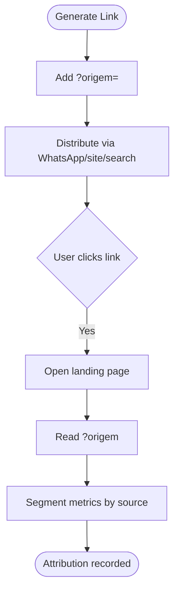
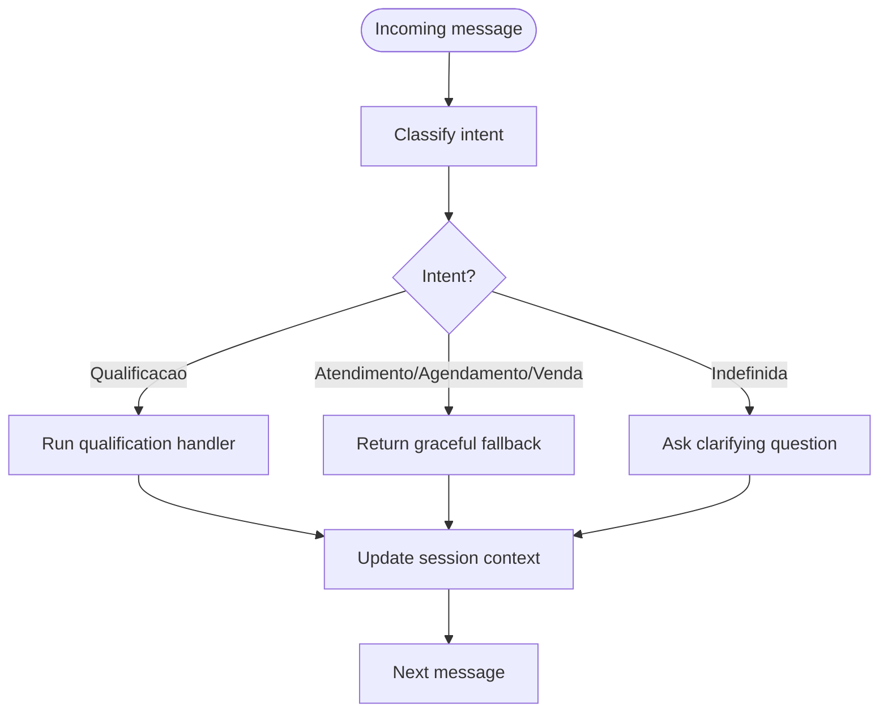
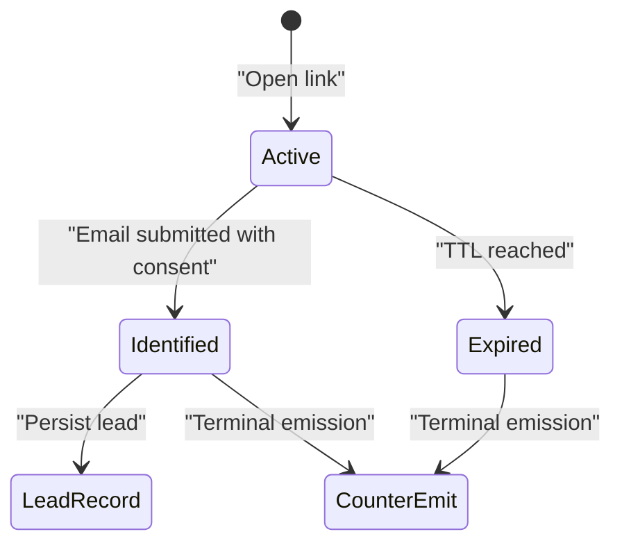
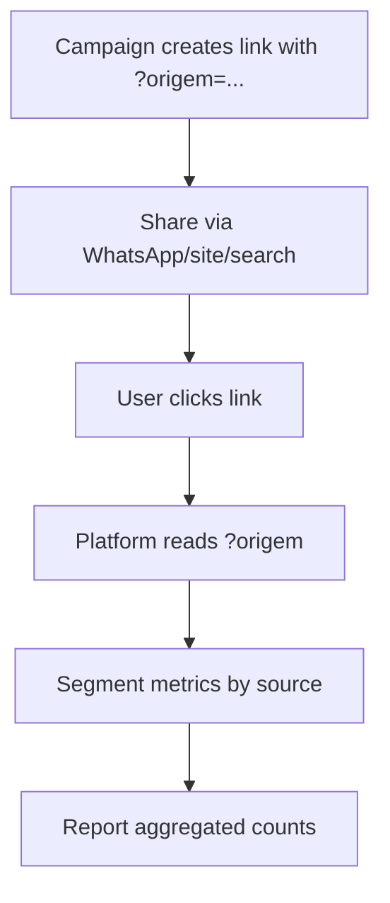
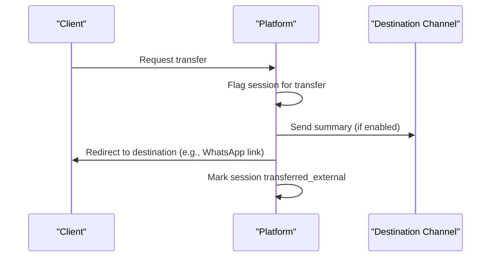
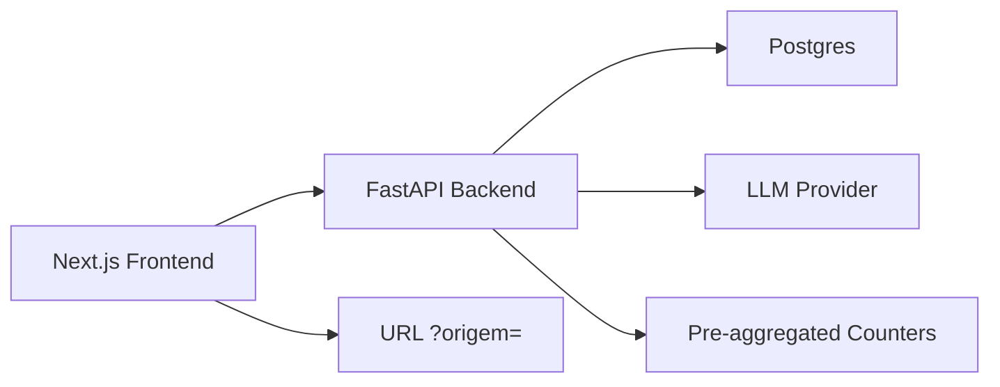

# WhatsApp Integration

<cite>
**Referenced Files in This Document**
- [DESIGN.md](file://.genie/brainstorms/plataforma-conversa-lead/DESIGN.md)
- [DRAFT.md](file://.genie/brainstorms/plataforma-conversa-lead/DRAFT.md)
- [01-actors-and-roles.md](file://docs/sdd/01-actors-and-roles.md)
- [02-user-stories.md](file://docs/sdd/02-user-stories.md)
- [03-functional-spec-backoffice.md](file://docs/sdd/03-functional-spec-backoffice.md)
- [04-transfer-workflow.md](file://docs/sdd/04-transfer-workflow.md)
</cite>

## Table of Contents
1. [Introduction](#introduction)
2. [Project Structure](#project-structure)
3. [Core Components](#core-components)
4. [Architecture Overview](#architecture-overview)
5. [Detailed Component Analysis](#detailed-component-analysis)
6. [Dependency Analysis](#dependency-analysis)
7. [Performance Considerations](#performance-considerations)
8. [Troubleshooting Guide](#troubleshooting-guide)
9. [Conclusion](#conclusion)
10. [Appendices](#appendices)

## Introduction
This document explains the WhatsApp integration patterns for the Sup Better Engine as defined by the project’s design and specifications. The platform treats WhatsApp as an entry point to drive users into a dedicated link-based conversation flow, rather than building a bidirectional WhatsApp API integration in this phase. Attribution is captured via URL parameters, conversations are routed by intent classification, and sessions are managed with rate limits and TTLs. Campaign attribution uses the source parameter to segment metrics without persisting per-session identifiers beyond session TTL.

Key principles:
- WhatsApp is a door, not a channel: static links are shared; no state sync between WhatsApp and the platform.
- All leads arrive anonymously; identification happens contextually during the chat.
- Intent classification drives routing per message; counters aggregate at session end.
- Rate limiting and per-session message caps protect public endpoints.
- Attribution relies on a URL source parameter for analytics and campaign segmentation.

**Section sources**
- [DESIGN.md:10-20](file://.genie/brainstorms/plataforma-conversa-lead/DESIGN.md#L10-L20)
- [DESIGN.md:47-166](file://.genie/brainstorms/plataforma-conversa-lead/DESIGN.md#L47-L166)
- [DRAFT.md:44-55](file://.genie/brainstorms/plataforma-conversa-lead/DRAFT.md#L44-L55)

## Project Structure
The repository contains design and specification documents that define the WhatsApp integration approach. There is no application code in this snapshot; the integration behavior is specified through design decisions, user stories, and functional specs.



**Diagram sources**
- [DESIGN.md:191-213](file://.genie/brainstorms/plataforma-conversa-lead/DESIGN.md#L191-L213)

**Section sources**
- [DESIGN.md:191-213](file://.genie/brainstorms/plataforma-conversa-lead/DESIGN.md#L191-L213)

## Core Components
- Link generation and attribution: Unique links carry a source parameter for attribution across channels (site, WhatsApp, search). No per-click tracking identifier is used; attribution is based on the source parameter.
- Conversation routing: Each incoming message is classified into intents; routing decisions are re-evaluated per message. Only one real handler exists in this phase; other intents use a graceful fallback.
- Session management: Anonymous sessions live in Postgres with TTL. Sessions are promoted to durable leads upon email submission with consent.
- Counters and snapshots: At session end or TTL expiry, a terminal emission increments pre-aggregated buckets across dimensions (source, intent, email state, validity). Weekly scalars summarize valid sessions.
- Rate limiting and message caps: IP-based rate limiting and per-session message ceilings protect the LLM endpoint. Exclusions are tracked separately for auditability.

**Section sources**
- [DESIGN.md:47-166](file://.genie/brainstorms/plataforma-conversa-lead/DESIGN.md#L47-L166)
- [DESIGN.md:191-213](file://.genie/brainstorms/plataforma-conversa-lead/DESIGN.md#L191-L213)

## Architecture Overview
The system routes traffic from WhatsApp to a link-based chat experience. The frontend reads the source parameter for attribution, while the backend manages agent logic, classification, and session lifecycle. Counters and weekly snapshots provide aggregated metrics without per-session PII retention.

```mermaid
sequenceDiagram
participant WA as "WhatsApp"
participant Link as "Static Link"
participant FE as "Next.js Frontend"
participant BE as "FastAPI Backend"
participant DB as "Postgres"
participant LLM as "LLM Provider"
WA->>Link : Share link with ?origem=whatsapp
Link->>FE : Open landing page
FE->>BE : Start session, read ?origem
BE->>DB : Create ephemeral session (TTL)
loop Per message
FE->>BE : Send message
BE->>LLM : Classify intent
LLM-->>BE : Intent label
alt Qualification
BE->>BE : Run qualification handler
else Other intents
BE->>BE : Return graceful fallback
end
BE->>DB : Update session context
end
Note over BE,DB : On session end or TTL
BE->>DB : Emit terminal counter increment
```

**Diagram sources**
- [DESIGN.md:191-213](file://.genie/brainstorms/plataforma-conversa-lead/DESIGN.md#L191-L213)
- [DESIGN.md:127-166](file://.genie/brainstorms/plataforma-conversa-lead/DESIGN.md#L127-L166)

## Detailed Component Analysis

### Link Generation and Attribution Tracking
- Links are static and include a source parameter for attribution. The platform does not generate unique per-click IDs; attribution is derived from the source parameter passed in the URL.
- Source values include known channels plus a “unknown” bucket when the parameter is missing or unrecognized.
- Metrics can be segmented by source where cell sizes allow; otherwise, results are labeled indicative.



**Diagram sources**
- [DESIGN.md:47-52](file://.genie/brainstorms/plataforma-conversa-lead/DESIGN.md#L47-L52)
- [DESIGN.md:127-166](file://.genie/brainstorms/plataforma-conversa-lead/DESIGN.md#L127-L166)

**Section sources**
- [DESIGN.md:47-52](file://.genie/brainstorms/plataforma-conversa-lead/DESIGN.md#L47-L52)
- [DESIGN.md:127-166](file://.genie/brainstorms/plataforma-conversa-lead/DESIGN.md#L127-L166)

### Message Processing and Routing Logic
- Each message is classified into one of several intents, including an explicit abstention for greetings or non-intent messages.
- Routing is re-evaluated per message: only the qualification intent triggers the real handler; other intents receive a graceful fallback.
- Aggregation for counters assigns the session’s intent to the first message that produces a non-abstention label.



**Diagram sources**
- [DESIGN.md:51-85](file://.genie/brainstorms/plataforma-conversa-lead/DESIGN.md#L51-L85)
- [DESIGN.md:225-232](file://.genie/brainstorms/plataforma-conversa-lead/DESIGN.md#L225-L232)

**Section sources**
- [DESIGN.md:51-85](file://.genie/brainstorms/plataforma-conversa-lead/DESIGN.md#L51-L85)
- [DESIGN.md:225-232](file://.genie/brainstorms/plataforma-conversa-lead/DESIGN.md#L225-L232)

### Webhook Integration Strategy
- In this phase, there is no bidirectional WhatsApp API integration or webhook handling. WhatsApp serves as an entry point by sharing a static link.
- The platform focuses on link-based conversations; any future WhatsApp API integration would require additional components not present in this scope.

**Section sources**
- [DESIGN.md:168-184](file://.genie/brainstorms/plataforma-conversa-lead/DESIGN.md#L168-L184)
- [DRAFT.md:44-55](file://.genie/brainstorms/plataforma-conversa-lead/DRAFT.md#L44-L55)

### Conversation State Management
- Sessions are ephemeral and stored in Postgres with a TTL. They hold conversation context until identification or expiration.
- Upon email submission with consent, sessions are promoted to durable lead records, deduplicated by normalized email.
- Terminal emissions update pre-aggregated counters at session end or TTL expiry.



**Diagram sources**
- [DESIGN.md:191-213](file://.genie/brainstorms/plataforma-conversa-lead/DESIGN.md#L191-L213)
- [DESIGN.md:127-166](file://.genie/brainstorms/plataforma-conversa-lead/DESIGN.md#L127-L166)

**Section sources**
- [DESIGN.md:191-213](file://.genie/brainstorms/plataforma-conversa-lead/DESIGN.md#L191-L213)
- [DESIGN.md:127-166](file://.genie/brainstorms/plataforma-conversa-lead/DESIGN.md#L127-L166)

### Template Messages and Media Support
- Template messages and media are out of scope for this phase. The focus is on text-based chat and minimal friction at entry.

**Section sources**
- [DESIGN.md:168-184](file://.genie/brainstorms/plataforma-conversa-lead/DESIGN.md#L168-L184)

### Campaign Attribution Workflows
- Campaign attribution is achieved via the source parameter in the link. Metrics can be segmented by source where sample sizes permit; otherwise, results are labeled indicative.
- Weekly snapshots summarize valid sessions for trend analysis.



**Diagram sources**
- [DESIGN.md:47-52](file://.genie/brainstorms/plataforma-conversa-lead/DESIGN.md#L47-L52)
- [DESIGN.md:127-166](file://.genie/brainstorms/plataforma-conversa-lead/DESIGN.md#L127-L166)

**Section sources**
- [DESIGN.md:47-52](file://.genie/brainstorms/plataforma-conversa-lead/DESIGN.md#L47-L52)
- [DESIGN.md:127-166](file://.genie/brainstorms/plataforma-conversa-lead/DESIGN.md#L127-L166)

### Transfer Workflow and Channel Options
- The transfer workflow supports external channel transfers, including WhatsApp as a destination type. When triggered, the system can send a conversation summary and redirect the client to the chosen channel.



**Diagram sources**
- [04-transfer-workflow.md:127-135](file://docs/sdd/04-transfer-workflow.md#L127-L135)

**Section sources**
- [04-transfer-workflow.md:127-135](file://docs/sdd/04-transfer-workflow.md#L127-L135)

## Dependency Analysis
- Frontend depends on URL parameters for attribution and renders the chat interface.
- Backend depends on classification service for intent detection and orchestrates handlers and fallbacks.
- Database stores ephemeral sessions and aggregated counters; weekly snapshots summarize trends.
- External LLM provider is used for intent classification; rate limiting protects against abuse.



**Diagram sources**
- [DESIGN.md:191-213](file://.genie/brainstorms/plataforma-conversa-lead/DESIGN.md#L191-L213)
- [DESIGN.md:127-166](file://.genie/brainstorms/plataforma-conversa-lead/DESIGN.md#L127-L166)

**Section sources**
- [DESIGN.md:191-213](file://.genie/brainstorms/plataforma-conversa-lead/DESIGN.md#L191-L213)
- [DESIGN.md:127-166](file://.genie/brainstorms/plataforma-conversa-lead/DESIGN.md#L127-L166)

## Performance Considerations
- Rate limiting: IP-based limits and per-session message caps protect the LLM endpoint and manage costs.
- Message ceiling: Sized using tenant’s historical WhatsApp conversations; defaults apply if authorization is not granted.
- Exclusions: Sessions exceeding limits or ceilings are excluded from engagement metrics but counted separately for auditability.
- Weekly snapshots: Provide efficient trend analysis without per-session timestamp overhead.

**Section sources**
- [DESIGN.md:112-126](file://.genie/brainstorms/plataforma-conversa-lead/DESIGN.md#L112-L126)
- [DESIGN.md:127-166](file://.genie/brainstorms/plataforma-conversa-lead/DESIGN.md#L127-L166)

## Troubleshooting Guide
Common issues and debugging techniques:
- Low link opening rate: Verify that the denominator (declared WhatsApp sends) is accurate and that the source parameter is correctly appended to links.
- High exclusion rates: Check rate limit thresholds and per-session message ceilings; review edge blocking counters for IP-based blocks.
- Misrouted messages: Ensure intent classification is validated and that routing is re-evaluated per message; confirm fallback behavior for non-qualification intents.
- Email collection friction: Confirm contextual timing and maximum display limits; validate email syntax and blocklist rules.
- Attribution gaps: Confirm that the source parameter is present and recognized; unknown sources fall into a separate bucket.

**Section sources**
- [DESIGN.md:112-166](file://.genie/brainstorms/plataforma-conversa-lead/DESIGN.md#L112-L166)
- [DESIGN.md:386-415](file://.genie/brainstorms/plataforma-conversa-lead/DESIGN.md#L386-L415)

## Conclusion
The Sup Better Engine’s WhatsApp integration centers on driving users from WhatsApp into a link-based conversation with robust attribution, intent-driven routing, and careful session management. By treating WhatsApp as an entry point and avoiding bidirectional API complexity in this phase, the platform focuses on proving adoption and quality of leads while maintaining compliance and cost controls. Future phases may expand capabilities, but current scope emphasizes simplicity, measurability, and operational safety.

[No sources needed since this section summarizes without analyzing specific files]

## Appendices

### Configuration Notes
- Session TTL: Configurable; default value defined in design.
- Rate limits: IP-based limits and per-session message ceilings; adjustable within safe ranges.
- Parameters: Operational parameters are provisional and reviewed regularly.

**Section sources**
- [DESIGN.md:112-126](file://.genie/brainstorms/plataforma-conversa-lead/DESIGN.md#L112-L126)

### Backoffice and Roles
- Roles and access control support monitoring, configuration, and compliance oversight.
- Operator dashboards provide visibility into active sessions and lead outputs.

**Section sources**
- [01-actors-and-roles.md:10-30](file://docs/sdd/01-actors-and-roles.md#L10-L30)
- [03-functional-spec-backoffice.md:26-82](file://docs/sdd/03-functional-spec-backoffice.md#L26-L82)