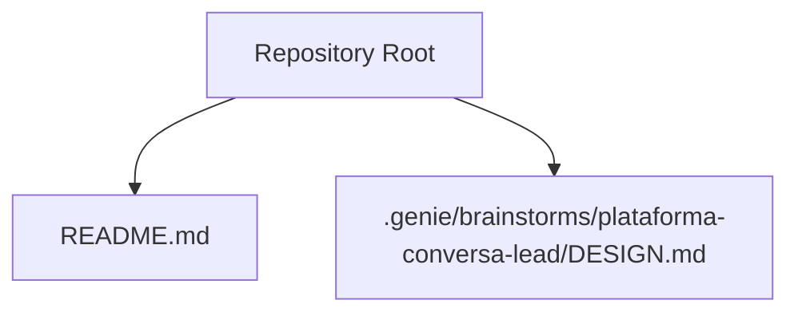
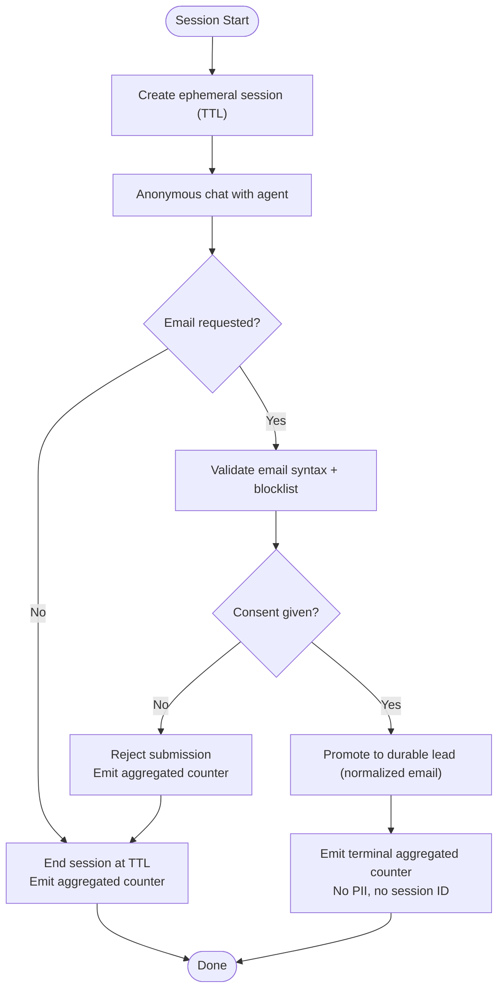
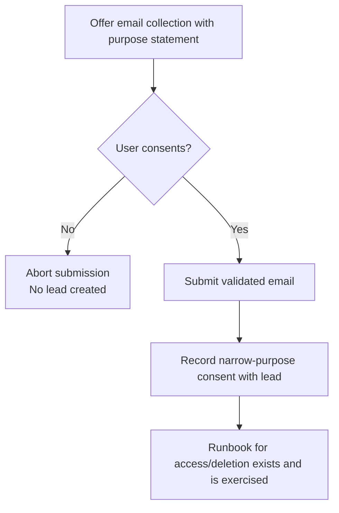
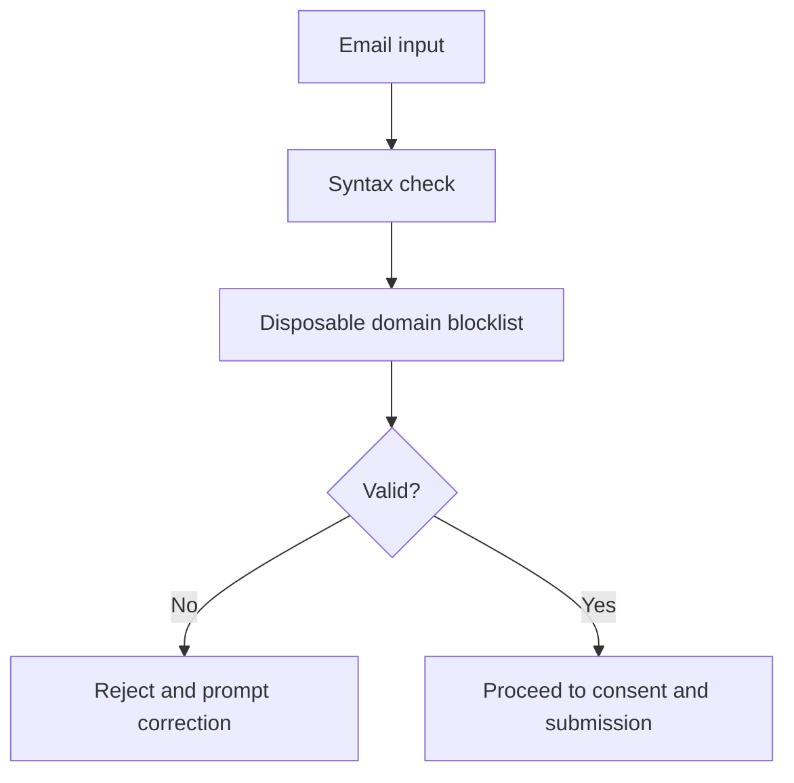
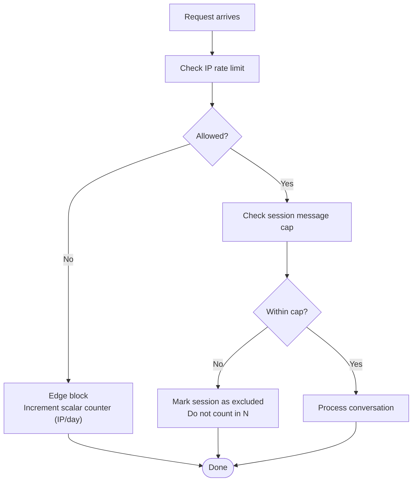
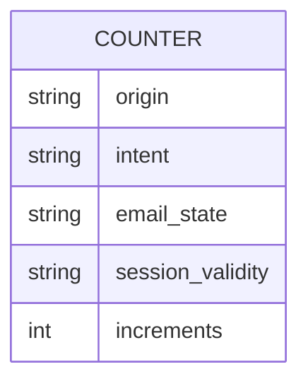
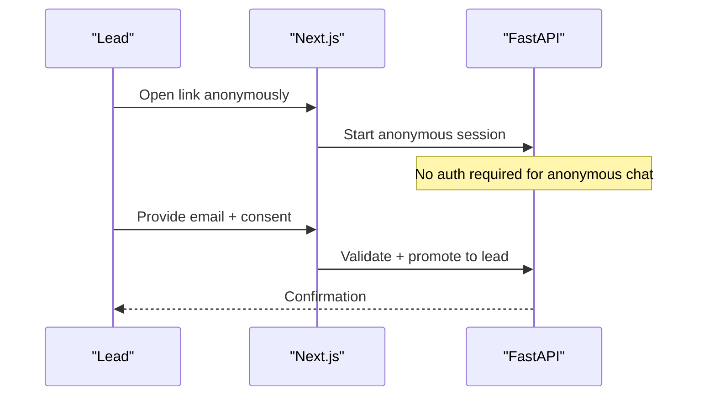
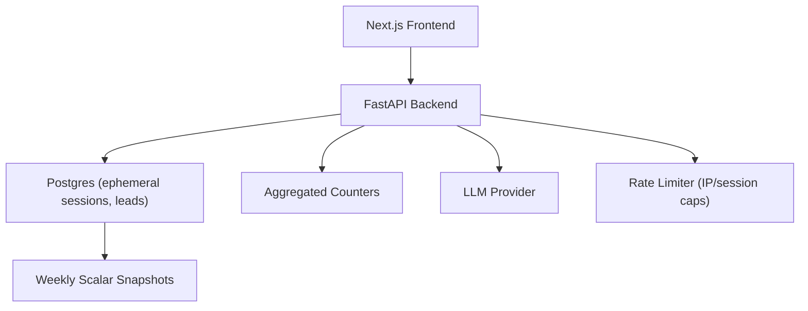

# Security Architecture

<cite>
**Referenced Files in This Document**
- [README.md](file://README.md)
- [DESIGN.md](file://.genie/brainstorms/plataforma-conversa-lead/DESIGN.md)
</cite>

## Table of Contents
1. Introduction
2. Project Structure
3. Core Components
4. Architecture Overview
5. Detailed Component Analysis
6. Dependency Analysis
7. Performance Considerations
8. Troubleshooting Guide
9. Conclusion

## Introduction
This document describes the security architecture for the Sup Better Engine’s lead conversation pilot (fatia 1). It focuses on how the system protects user identity, enforces consent and privacy, limits abuse, and remains compliant with LGPD/GDPR principles. The design intentionally starts anonymous, collects minimal data, and aggregates metrics to avoid individual tracking.

Key security goals:
- Protect user identity during anonymous sessions
- Enforce granular consent aligned with LGPD/GDPR
- Limit abuse via rate limiting and message caps
- Minimize personal data retention and exposure
- Provide auditability for compliance without re-introducing individual tracking

[No sources needed since this section summarizes without analyzing specific files]

## Project Structure
The repository currently contains a high-level README and a detailed design specification under .genie. The security-relevant details are captured in the design specification, which outlines the end-to-end flow, data handling, and controls.



**Diagram sources**
- [README.md:1-8](file://README.md#L1-L8)
- [DESIGN.md:1-10](file://.genie/brainstorms/plataforma-conversa-lead/DESIGN.md#L1-L10)

**Section sources**
- [README.md:1-8](file://README.md#L1-L8)
- [DESIGN.md:1-10](file://.genie/brainstorms/plataforma-conversa-lead/DESIGN.md#L1-L10)

## Core Components
The security architecture is centered around these components and controls:

- Anonymous session lifecycle with TTL-based expiration
- Consent-as-gate for email submission and lead creation
- Email validation and disposable domain blocklist
- Rate limiting per IP and per-session message cap
- Privacy-preserving analytics using pre-aggregated counters
- Manual access and deletion runbook for data subject rights
- Third-party LLM provider constraints (retention policy and DPA)

These elements collectively ensure that the system minimizes PII exposure, avoids individual tracking, and provides measurable protection against abuse while remaining compliant with LGPD/GDPR requirements.

**Section sources**
- [DESIGN.md:99-116](file://.genie/brainstorms/plataforma-conversa-lead/DESIGN.md#L99-L116)
- [DESIGN.md:127-165](file://.genie/brainstorms/plataforma-conversa-lead/DESIGN.md#L127-L165)
- [DESIGN.md:191-213](file://.genie/brainstorms/plataforma-conversa-lead/DESIGN.md#L191-L213)
- [DESIGN.md:352-361](file://.genie/brainstorms/plataforma-conversa-lead/DESIGN.md#L352-L361)
- [DESIGN.md:378-382](file://.genie/brainstorms/plataforma-conversa-lead/DESIGN.md#L378-L382)

## Architecture Overview
High-level flow from client to backend and storage, emphasizing privacy and security boundaries:

```mermaid
sequenceDiagram
participant Client as "Client Browser"
participant NextJS as "Next.js Frontend"
participant FastAPI as "FastAPI Backend"
participant DB as "Postgres (Sessions & Leads)"
participant Counter as "Aggregated Counters"
participant LLM as "LLM Provider"
Client->>NextJS : Open landing link (?origem=...)
NextJS->>FastAPI : Start anonymous session
FastAPI->>DB : Create ephemeral session row (TTL)
loop Conversation turns
Client->>NextJS : Send message
NextJS->>FastAPI : Route by intent classifier
FastAPI->>LLM : Classify intent / generate response
FastAPI-->>NextJS : Response (fallback or qualification)
Note over FastAPI,LLM : Rate limit per IP and per-session message cap enforced
end
alt Email requested and consent given
NextJS->>FastAPI : Submit validated email + consent
FastAPI->>DB : Promote session to durable lead (normalized email)
FastAPI-->>Counter : Emit terminal aggregated counter (no PII)
else No consent or invalid email
FastAPI-->>Counter : Emit terminal aggregated counter (no PII)
end
Note over DB : Ephemeral session rows expire at TTL; no individual event logs retained
```

**Diagram sources**
- [DESIGN.md:191-213](file://.genie/brainstorms/plataforma-conversa-lead/DESIGN.md#L191-L213)
- [DESIGN.md:127-165](file://.genie/brainstorms/plataforma-conversa-lead/DESIGN.md#L127-L165)
- [DESIGN.md:352-361](file://.genie/brainstorms/plataforma-conversa-lead/DESIGN.md#L352-L361)

**Section sources**
- [DESIGN.md:191-213](file://.genie/brainstorms/plataforma-conversa-lead/DESIGN.md#L191-L213)
- [DESIGN.md:127-165](file://.genie/brainstorms/plataforma-conversa-lead/DESIGN.md#L127-L165)

## Detailed Component Analysis

### Anonymous Sessions and Identity Protection
- Sessions start anonymous; identification occurs only after contextual request and explicit consent.
- Ephemeral session rows persist only until TTL expiry; transcripts and context are discarded.
- No cookie stitching between anonymous sessions and identified leads; this avoids persistent identifiers and reduces tracking surface.
- Deduplication uses normalized email (trim + lowercase) to prevent duplicates without introducing additional identifiers.



**Diagram sources**
- [DESIGN.md:191-213](file://.genie/brainstorms/plataforma-conversa-lead/DESIGN.md#L191-L213)
- [DESIGN.md:352-358](file://.genie/brainstorms/plataforma-conversa-lead/DESIGN.md#L352-L358)

**Section sources**
- [DESIGN.md:191-213](file://.genie/brainstorms/plataforma-conversa-lead/DESIGN.md#L191-L213)
- [DESIGN.md:352-358](file://.genie/brainstorms/plataforma-conversa-lead/DESIGN.md#L352-L358)

### Consent Management and LGPD/GDPR Alignment
- Consent is the gate for email submission; purpose is narrowly scoped to commercial follow-up for the current conversation.
- Marketing consent is not collected in this slice; it belongs to the marketing-dispatching slice to satisfy granularity requirements.
- No separate “consent checkbox” state; refusal means no submission, avoiding divergent states between metrics and stored data.
- Data subject rights: documented manual runbook for access and deletion, with an assigned owner.



**Diagram sources**
- [DESIGN.md:101-111](file://.genie/brainstorms/plataforma-conversa-lead/DESIGN.md#L101-L111)
- [DESIGN.md:356-358](file://.genie/brainstorms/plataforma-conversa-lead/DESIGN.md#L356-L358)

**Section sources**
- [DESIGN.md:101-111](file://.genie/brainstorms/plataforma-conversa-lead/DESIGN.md#L101-L111)
- [DESIGN.md:356-358](file://.genie/brainstorms/plataforma-conversa-lead/DESIGN.md#L356-L358)

### Input Validation Strategies
- Email validation includes syntax checks and a public blocklist of disposable domains.
- No ownership verification (confirmation code) in this slice to reduce friction; limitation is declared.
- Intent classification informs routing and fallback behavior; abstinence label prevents misclassification of greetings.



**Diagram sources**
- [DESIGN.md:99-100](file://.genie/brainstorms/plataforma-conversa-lead/DESIGN.md#L99-L100)
- [DESIGN.md:354-355](file://.genie/brainstorms/plataforma-conversa-lead/DESIGN.md#L354-L355)

**Section sources**
- [DESIGN.md:99-100](file://.genie/brainstorms/plataforma-conversa-lead/DESIGN.md#L99-L100)
- [DESIGN.md:354-355](file://.genie/brainstorms/plataforma-conversa-lead/DESIGN.md#L354-L355)

### Rate Limiting and Abuse Mitigation
- Per-IP rate limiting and per-session message caps protect the public LLM endpoint.
- Caps are sized based on tenant WhatsApp history; if unauthorized, a default cap applies.
- Blocked requests at the edge are counted operationally (scalar) per IP per day; they do not create session records to avoid inflating session counts and enabling cost scaling with attacks.
- Exclusions due to rate limit or cap are tracked separately to preserve metric integrity.



**Diagram sources**
- [DESIGN.md:112-123](file://.genie/brainstorms/plataforma-conversa-lead/DESIGN.md#L112-L123)
- [DESIGN.md:159-165](file://.genie/brainstorms/plataforma-conversa-lead/DESIGN.md#L159-L165)
- [DESIGN.md:398-399](file://.genie/brainstorms/plataforma-conversa-lead/DESIGN.md#L398-L399)

**Section sources**
- [DESIGN.md:112-123](file://.genie/brainstorms/plataforma-conversa-lead/DESIGN.md#L112-L123)
- [DESIGN.md:159-165](file://.genie/brainstorms/plataforma-conversa-lead/DESIGN.md#L159-L165)
- [DESIGN.md:398-399](file://.genie/brainstorms/plataforma-conversa-lead/DESIGN.md#L398-L399)

### Privacy-Preserving Analytics Design
- Metrics are emitted as pre-aggregated counters at session end or TTL expiry; no session IDs or timestamps per session are retained.
- Counters use low-cardinality categorical dimensions (origin, intent, email state, validity) to avoid reconstructable traces.
- Weekly snapshots store only scalars (accumulated valid sessions), not bucketed cuts, preventing temporal correlation.
- Operational blocking counters are kept separate from session buckets to maintain unit consistency and auditability.



**Diagram sources**
- [DESIGN.md:127-165](file://.genie/brainstorms/plataforma-conversa-lead/DESIGN.md#L127-L165)

**Section sources**
- [DESIGN.md:127-165](file://.genie/brainstorms/plataforma-conversa-lead/DESIGN.md#L127-L165)

### Authentication and Authorization Patterns
- Public, anonymous entry is by design; authentication is deferred until contextual email submission with consent.
- Multi-tenancy is out of scope for this slice; a single pilot tenant is configured manually.
- Authorization beyond consent gating is not implemented here; future slices may introduce admin and tenant controls.



**Diagram sources**
- [DESIGN.md:191-213](file://.genie/brainstorms/plataforma-conversa-lead/DESIGN.md#L191-L213)
- [DESIGN.md:346-351](file://.genie/brainstorms/plataforma-conversa-lead/DESIGN.md#L346-L351)

**Section sources**
- [DESIGN.md:191-213](file://.genie/brainstorms/plataforma-conversa-lead/DESIGN.md#L191-L213)
- [DESIGN.md:346-351](file://.genie/brainstorms/plataforma-conversa-lead/DESIGN.md#L346-L351)

### Protection Against Common Web Vulnerabilities
- Input validation (email syntax and blocklist) mitigates injection and spam risks.
- Rate limiting and message caps mitigate DoS and resource exhaustion.
- Minimal data retention and aggregation reduce risk of data leakage and re-identification.
- Explicit third-party LLM constraints (retention policy and signed DPA) limit downstream exposure.

[No sources needed since this section synthesizes previously cited controls]

### Data Encryption Approaches
- The design does not specify encryption mechanisms in this slice. Implementers should apply transport encryption (TLS) and consider encryption at rest for sensitive fields where applicable, consistent with organizational policies.

[No sources needed since this section provides general guidance]

### Secure Session Management
- Ephemeral sessions stored in Postgres with TTL; transcripts and context are discarded upon expiry.
- No persistent cookies linking anonymous sessions to identified leads; this avoids cross-session tracking.
- Session promotion to durable lead occurs only after consent and validation.

**Section sources**
- [DESIGN.md:191-213](file://.genie/brainstorms/plataforma-conversa-lead/DESIGN.md#L191-L213)
- [DESIGN.md:352-358](file://.genie/brainstorms/plataforma-conversa-lead/DESIGN.md#L352-L358)

### Audit Trail Mechanisms for Compliance
- Operational blocking counters (per IP per day) provide auditability for rate-limit enforcement without creating session records.
- Terminal aggregated counters enable reconciliation of outcomes without individual traces.
- Weekly scalar snapshots support trend monitoring without reintroducing per-session correlation.

**Section sources**
- [DESIGN.md:159-165](file://.genie/brainstorms/plataforma-conversa-lead/DESIGN.md#L159-L165)
- [DESIGN.md:127-165](file://.genie/brainstorms/plataforma-conversa-lead/DESIGN.md#L127-L165)

## Dependency Analysis
Security controls depend on coordinated interactions across frontend, backend, database, and external providers:



**Diagram sources**
- [DESIGN.md:191-213](file://.genie/brainstorms/plataforma-conversa-lead/DESIGN.md#L191-L213)
- [DESIGN.md:127-165](file://.genie/brainstorms/plataforma-conversa-lead/DESIGN.md#L127-L165)
- [DESIGN.md:352-361](file://.genie/brainstorms/plataforma-conversa-lead/DESIGN.md#L352-L361)

**Section sources**
- [DESIGN.md:191-213](file://.genie/brainstorms/plataforma-conversa-lead/DESIGN.md#L191-L213)
- [DESIGN.md:127-165](file://.genie/brainstorms/plataforma-conversa-lead/DESIGN.md#L127-L165)
- [DESIGN.md:352-361](file://.genie/brainstorms/plataforma-conversa-lead/DESIGN.md#L352-L361)

## Performance Considerations
- Aggregated counters minimize storage overhead and avoid per-event logging costs.
- Rate limiting and message caps protect backend resources and control LLM usage costs.
- TTL-based session cleanup ensures bounded storage growth.
- Weekly scalar snapshots reduce reporting load while preserving trend visibility.

[No sources needed since this section provides general guidance]

## Troubleshooting Guide
Common issues and their implications:
- High opening rates without proportional engagement may indicate automated traffic; rate limiting contains gross abuse but sophisticated bots remain unmitigated in this slice.
- Conversion underestimation can occur when message caps exclude highly engaged sessions; exclusions are tracked separately to preserve metric accuracy.
- Consent failures due to disposable domains or syntax errors should be surfaced with corrective prompts; retries update the monotonic email state correctly.
- LLM provider retention must be verified via signed DPA prior to pilot launch; any violation cannot be undone once data has been transmitted.

**Section sources**
- [DESIGN.md:378-382](file://.genie/brainstorms/plataforma-conversa-lead/DESIGN.md#L378-L382)
- [DESIGN.md:398-399](file://.genie/brainstorms/plataforma-conversa-lead/DESIGN.md#L398-L399)

## Conclusion
The Sup Better Engine’s fatia 1 adopts a privacy-first, security-conscious approach:
- Anonymous-by-default sessions with strict TTL and no persistent identifiers
- Granular consent tied to a narrow purpose, aligned with LGPD/GDPR
- Strong input validation and robust rate limiting to mitigate abuse
- Privacy-preserving analytics through pre-aggregated counters and scalar snapshots
- Clear auditability for compliance without reintroducing individual tracking

These measures collectively protect user identity, ensure compliance, and maintain operational resilience while enabling personalized experiences within tight privacy boundaries.

[No sources needed since this section summarizes without analyzing specific files]