# System Architecture

<cite>
**Referenced Files in This Document**
- [README.md](file://README.md)
- [INDEX.md](file://.genie/INDEX.md)
- [DESIGN.md](file://.genie/brainstorms/plataforma-conversa-lead/DESIGN.md)
- [DRAFT.md](file://.genie/brainstorms/plataforma-conversa-lead/DRAFT.md)
- [01-actors-and-roles.md](file://docs/sdd/01-actors-and-roles.md)
- [03-functional-spec-backoffice.md](file://docs/sdd/03-functional-spec-backoffice.md)
- [04-transfer-workflow.md](file://docs/sdd/04-transfer-workflow.md)
- [05-campaign-management.md](file://docs/sdd/05-campaign-management.md)
- [06-gap-analysis.md](file://docs/sdd/06-gap-analysis.md)
</cite>

## Update Summary
**Changes Made**
- Added comprehensive backoffice RBAC system with 3-tier access control (Operador, Liderança, Gestão)
- Enhanced campaign attribution tracking via structured CampaignConfig with ?origem= parameter management
- Integrated transfer workflow system with 3 triggers and separate counting mechanisms
- Updated architecture diagrams to reflect new backoffice components and campaign management
- Expanded security considerations for RBAC implementation and audit logging
- Added operational dashboards and monitoring capabilities

## Table of Contents
1. Introduction
2. Project Structure
3. Core Components
4. Architecture Overview
5. Detailed Component Analysis
6. Dependency Analysis
7. Performance Considerations
8. Security & Compliance
9. Troubleshooting Guide
10. Conclusion

## Introduction
This document describes the enhanced system architecture for the Sup Better Engine, a microservices-style platform that connects leads to an automated agent via a web chat and converts anonymous sessions into durable leads with privacy-preserving analytics. The design separates:
- Frontend: Next.js (landing page, streaming chat UI, identification mini-screen)
- Backend: FastAPI (intent classification, conversation routing, lead management, rate limiting, analytics emissions)
- Data layer: PostgreSQL (ephemeral sessions with TTL, durable leads, aggregated counters, backoffice data)
- Backoffice: RBAC-enabled admin interface with 3-tier access control (Operador, Liderança, Gestão)

The scope includes a thin vertical slice that proves whether leads accept moving from WhatsApp to a dedicated link-based chat, classifies intent per message, routes to a qualification handler or graceful fallback, emits anonymized, pre-aggregated analytics without retaining session identifiers, and provides comprehensive operational oversight through the backoffice system.

**Section sources**
- [DESIGN.md:190-214](file://.genie/brainstorms/plataforma-conversa-lead/DESIGN.md#L190-L214)
- [DRAFT.md:11-19](file://.genie/brainstorms/plataforma-conversa-lead/DRAFT.md#L11-L19)
- [01-actors-and-roles.md:10-30](file://docs/sdd/01-actors-and-roles.md#L10-L30)

## Project Structure
At this stage, the repository contains project metadata, design artifacts, and comprehensive SDD documents that define the enhanced architecture and scope. The codebase is in early stages; the architectural blueprint is captured in the design documents with detailed specifications for backoffice, campaigns, and transfer workflows.

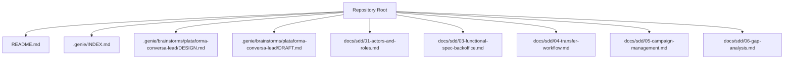

**Diagram sources**
- [README.md:1-8](file://README.md#L1-L8)
- [INDEX.md:1-23](file://.genie/INDEX.md#L1-L23)
- [DESIGN.md:1-500](file://.genie/brainstorms/plataforma-conversa-lead/DESIGN.md#L1-L500)
- [DRAFT.md:1-198](file://.genie/brainstorms/plataforma-conversa-lead/DRAFT.md#L1-L198)
- [01-actors-and-roles.md:1-100](file://docs/sdd/01-actors-and-roles.md#L1-L100)
- [03-functional-spec-backoffice.md:1-335](file://docs/sdd/03-functional-spec-backoffice.md#L1-L335)
- [04-transfer-workflow.md:1-295](file://docs/sdd/04-transfer-workflow.md#L1-L295)
- [05-campaign-management.md:1-262](file://docs/sdd/05-campaign-management.md#L1-L262)
- [06-gap-analysis.md:1-248](file://docs/sdd/06-gap-analysis.md#L1-L248)

**Section sources**
- [README.md:1-8](file://README.md#L1-L8)
- [INDEX.md:1-23](file://.genie/INDEX.md#L1-L23)

## Core Components
- **Intent Classification**: Per-message classifier that outputs a single intent field with five values: qualification, service, scheduling, sales, or undefined (abstention). Abstention prevents forcing labels on greetings and protects metric integrity.
- **Conversation Routing**: Re-evaluated per message. Qualification goes to the real handler; other intents go to a graceful fallback; undefined triggers a clarifying question from the agent.
- **Lead Management**: Contextual email request after capturing intent, urgency, and fit or by turn 4, with at most two displays per session. Email validation includes syntax and disposable domain blocklist. Consent is the act of sending, with restricted purpose for commercial return about this conversation. Promotion from ephemeral session to durable lead occurs on acceptance, deduplicated by normalized email.
- **Analytics**: Privacy-preserving, pre-aggregated counters emitted once per session at close or TTL expiry. Counters increment categorical buckets across origin, intent, email state, and session validity. No session IDs or per-session timestamps are retained. Weekly scalar snapshots track total valid sessions.
- **Session Management**: Anonymous sessions stored in PostgreSQL with TTL. Sessions carry conversation context until identification or TTL expiration. Unidentified sessions are discarded with their transcripts.
- **Rate Limiting**: IP-based rate limiting and per-session message caps protect the LLM endpoint. Blocked requests are counted as operational scalars by IP and day, not as sessions.
- **Backoffice RBAC**: Three-tier access control system (Operador, Liderança, Gestão) with role-based permissions, audit logging, and operational dashboards for monitoring sessions, managing operators, and making strategic decisions.
- **Campaign Attribution**: Structured campaign management with CampaignConfig model supporting ?origem= parameter tracking, link generation, and attribution metrics.
- **Transfer Workflow**: Formalized transfer system with three triggers (no transfer configured, operator decision, client request) and separate counting mechanisms for transfer events.

**Section sources**
- [DESIGN.md:53-85](file://.genie/brainstorms/plataforma-conversa-lead/DESIGN.md#L53-L85)
- [DESIGN.md:86-116](file://.genie/brainstorms/plataforma-conversa-lead/DESIGN.md#L86-L116)
- [DESIGN.md:127-166](file://.genie/brainstorms/plataforma-conversa-lead/DESIGN.md#L127-L166)
- [DESIGN.md:190-214](file://.genie/brainstorms/plataforma-conversa-lead/DESIGN.md#L190-L214)
- [DESIGN.md:225-233](file://.genie/brainstorms/plataforma-conversa-lead/DESIGN.md#L225-L233)
- [01-actors-and-roles.md:10-30](file://docs/sdd/01-actors-and-roles.md#L10-L30)
- [03-functional-spec-backoffice.md:37-82](file://docs/sdd/03-functional-spec-backoffice.md#L37-L82)
- [04-transfer-workflow.md:20-58](file://docs/sdd/04-transfer-workflow.md#L20-L58)
- [05-campaign-management.md:28-56](file://docs/sdd/05-campaign-management.md#L28-L56)

## Architecture Overview
Enhanced high-level flow with backoffice integration:
- Client opens a unique link with attribution parameter (?origem=).
- Next.js renders landing and streaming chat UI, including the identification mini-screen when triggered.
- Messages are sent to FastAPI, which classifies intent per message and routes accordingly.
- Qualification handler captures structured data and prompts for email if conditions are met.
- Email validation and consent gate promotion to durable lead.
- On session close or TTL expiry, a terminal emission increments pre-aggregated counters without PII or session identifiers.
- Weekly snapshots record total valid sessions for trend analysis.
- Backoffice provides operational oversight with RBAC-controlled access to sessions, leads, and metrics.
- Campaign configuration manages attribution links and tracking parameters.
- Transfer workflow handles conversation handoff scenarios with formalized triggers.

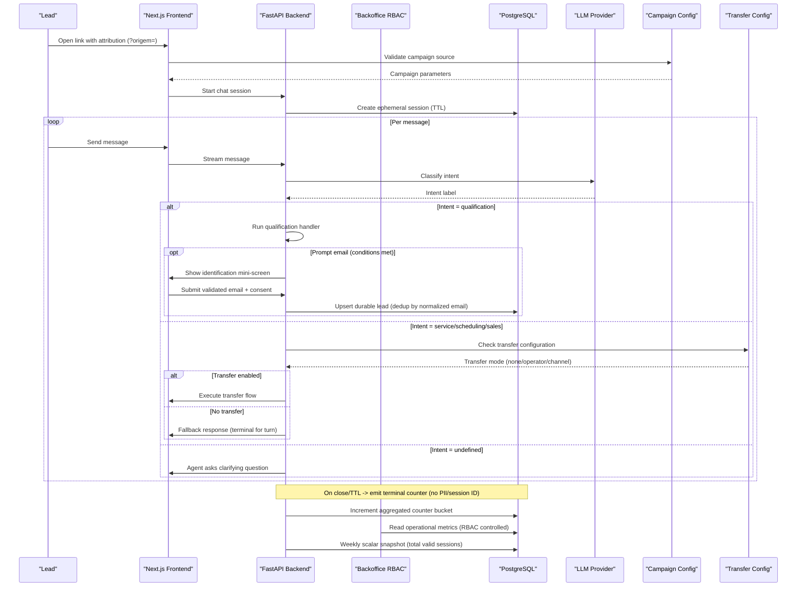

**Diagram sources**
- [DESIGN.md:53-85](file://.genie/brainstorms/plataforma-conversa-lead/DESIGN.md#L53-L85)
- [DESIGN.md:86-116](file://.genie/brainstorms/plataforma-conversa-lead/DESIGN.md#L86-L116)
- [DESIGN.md:127-166](file://.genie/brainstorms/plataforma-conversa-lead/DESIGN.md#L127-L166)
- [DESIGN.md:190-214](file://.genie/brainstorms/plataforma-conversa-lead/DESIGN.md#L190-L214)
- [DESIGN.md:225-233](file://.genie/brainstorms/plataforma-conversa-lead/DESIGN.md#L225-L233)
- [03-functional-spec-backoffice.md:286-328](file://docs/sdd/03-functional-spec-backoffice.md#L286-L328)
- [04-transfer-workflow.md:80-98](file://docs/sdd/04-transfer-workflow.md#L80-L98)
- [05-campaign-management.md:121-134](file://docs/sdd/05-campaign-management.md#L121-L134)

## Detailed Component Analysis

### Enhanced Backoffice RBAC System
**Updated** - New comprehensive RBAC system with three-tier access control

The backoffice system implements a sophisticated role-based access control model with three distinct levels:

- **Operador (Operator)**: Day-to-day operations including session monitoring, lead review, and escalation handling
- **Liderança (Leadership)**: Team oversight, operator management, operational parameter configuration, and performance metrics
- **Gestão (Management)**: Strategic decisions, compliance oversight, go/no-go decisions, and contract management

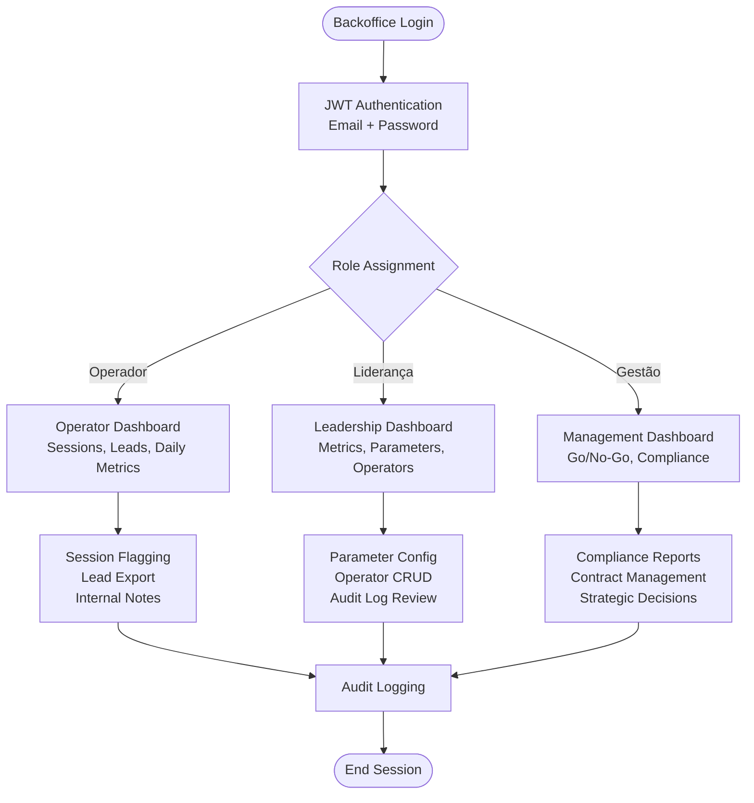

**Diagram sources**
- [03-functional-spec-backoffice.md:37-82](file://docs/sdd/03-functional-spec-backoffice.md#L37-L82)
- [03-functional-spec-backoffice.md:85-168](file://docs/sdd/03-functional-spec-backoffice.md#L85-L168)
- [03-functional-spec-backoffice.md:170-260](file://docs/sdd/03-functional-spec-backoffice.md#L170-L260)

**Section sources**
- [01-actors-and-roles.md:10-30](file://docs/sdd/01-actors-and-roles.md#L10-L30)
- [03-functional-spec-backoffice.md:37-82](file://docs/sdd/03-functional-spec-backoffice.md#L37-L82)
- [03-functional-spec-backoffice.md:263-281](file://docs/sdd/03-functional-spec-backoffice.md#L263-L281)

### Campaign Attribution Tracking via Origem Parameters
**Updated** - Enhanced campaign management with structured attribution tracking

Campaign configuration now supports structured attribution through the CampaignConfig model, enabling precise tracking of traffic sources and campaign performance:

- **CampaignConfig Model**: Stores campaign metadata, attribution values, and optional parameter overrides
- **Link Generation**: Automatic URL creation with ?origem= parameters for attribution tracking
- **Attribution Logic**: Validates and applies campaign-specific settings during session creation
- **Counter Integration**: Maps campaign origins to counter bucket dimensions for performance analysis

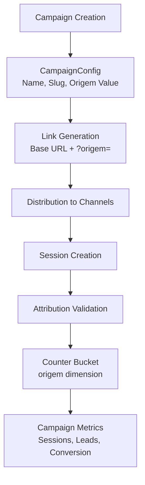

**Diagram sources**
- [05-campaign-management.md:28-56](file://docs/sdd/05-campaign-management.md#L28-L56)
- [05-campaign-management.md:121-134](file://docs/sdd/05-campaign-management.md#L121-L134)
- [05-campaign-management.md:136-151](file://docs/sdd/05-campaign-management.md#L136-L151)

**Section sources**
- [05-campaign-management.md:28-56](file://docs/sdd/05-campaign-management.md#L28-L56)
- [05-campaign-management.md:107-151](file://docs/sdd/05-campaign-management.md#L107-L151)
- [05-campaign-management.md:226-252](file://docs/sdd/05-campaign-management.md#L226-L252)

### Transfer Workflow Integration with Separate Counting
**Updated** - Formalized transfer system with three triggers and independent counting mechanisms

The transfer workflow provides structured conversation handoff capabilities with three explicit triggers and separate counting mechanisms:

- **Trigger 1 (Não há)**: No transfer configured - falls back to static message with contact information
- **Trigger 2 (Alguém decidiu)**: Operator/system decision to transfer - queued for human intervention
- **Trigger 3 (Solicitação do cliente)**: Client-requested transfer - detected via keyword matching

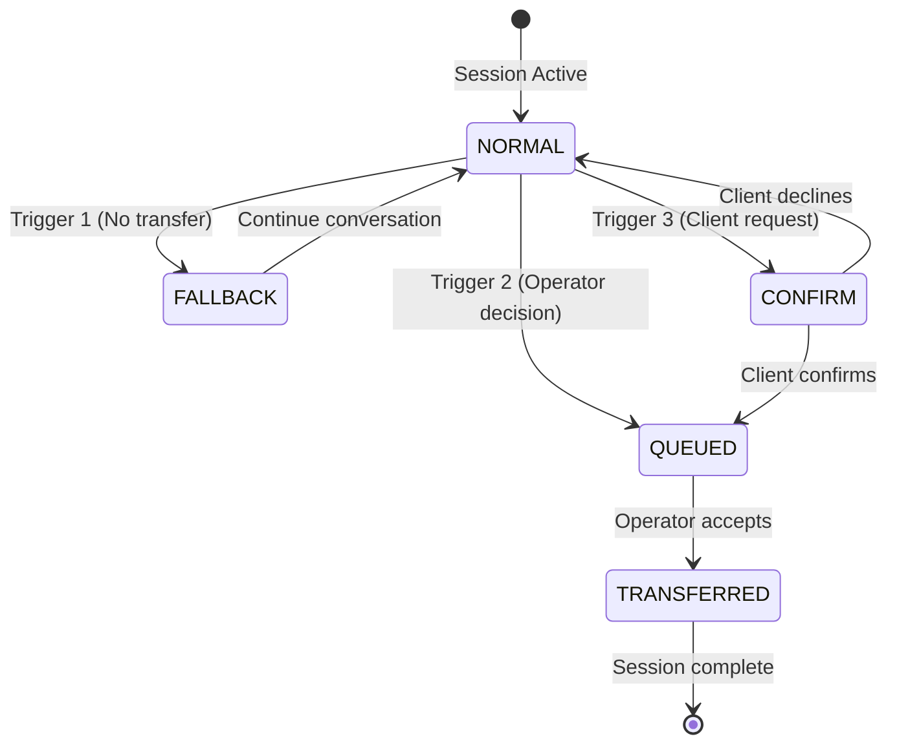

**Diagram sources**
- [04-transfer-workflow.md:195-235](file://docs/sdd/04-transfer-workflow.md#L195-L235)
- [04-transfer-workflow.md:80-98](file://docs/sdd/04-transfer-workflow.md#L80-L98)
- [04-transfer-workflow.md:102-148](file://docs/sdd/04-transfer-workflow.md#L102-L148)

**Section sources**
- [04-transfer-workflow.md:20-58](file://docs/sdd/04-transfer-workflow.md#L20-L58)
- [04-transfer-workflow.md:78-184](file://docs/sdd/04-transfer-workflow.md#L78-L184)
- [04-transfer-workflow.md:252-267](file://docs/sdd/04-transfer-workflow.md#L252-L267)

### Intent Classification and Routing
- Classifier interface: message → intent ∈ {qualification, service, scheduling, sales, undefined}. Undefined is explicit abstention to avoid mislabeling greetings.
- Routing cadence: per message. Counter aggregation cadence: per session, inheriting the first non-undefined intent. This separation avoids composing classifier error across turns.
- Handlers: one real handler (qualification) and one graceful fallback for other intents. Fallback is terminal for the turn but not the session.

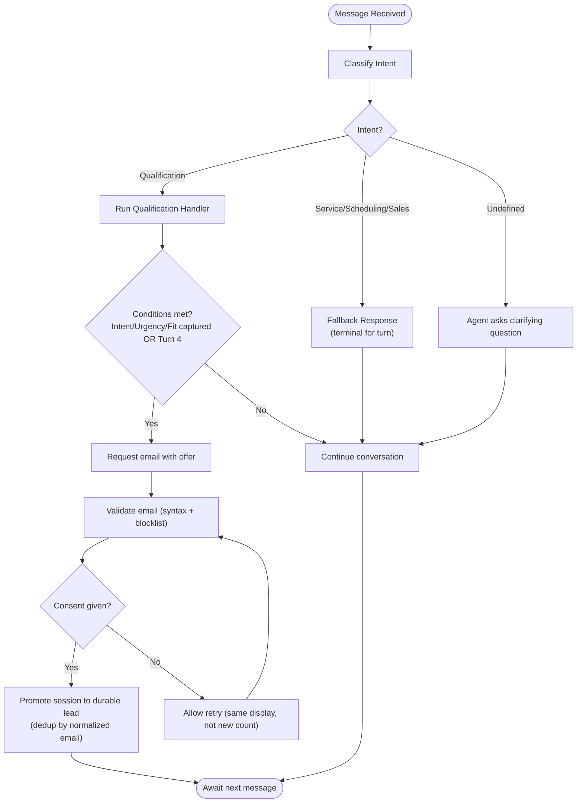

**Diagram sources**
- [DESIGN.md:53-85](file://.genie/brainstorms/plataforma-conversa-lead/DESIGN.md#L53-L85)
- [DESIGN.md:86-116](file://.genie/brainstorms/plataforma-conversa-lead/DESIGN.md#L86-L116)
- [DESIGN.md:225-233](file://.genie/brainstorms/plataforma-conversa-lead/DESIGN.md#L225-L233)

**Section sources**
- [DESIGN.md:53-85](file://.genie/brainstorms/plataforma-conversa-lead/DESIGN.md#L53-L85)
- [DESIGN.md:225-233](file://.genie/brainstorms/plataforma-conversa-lead/DESIGN.md#L225-L233)

### Session Management and TTL
- Anonymous sessions live in PostgreSQL with TTL; no Redis required for pilot scale.
- Session carries conversation context until identification or TTL expiry. Transcripts are discarded with TTL.
- Identification promotes session to a durable lead record; unconverted sessions are dropped.

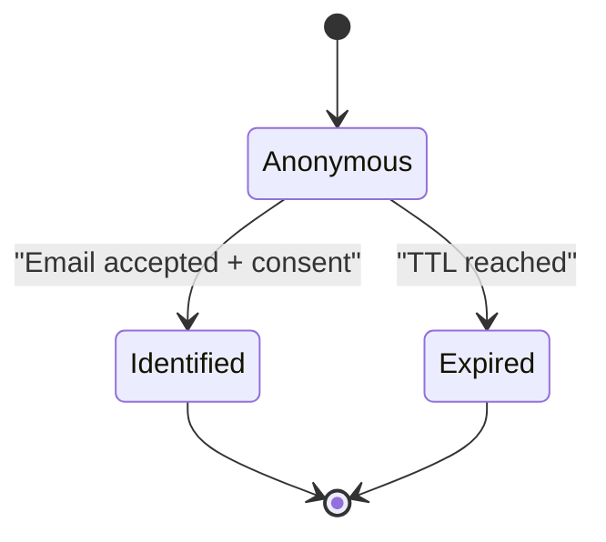

**Diagram sources**
- [DESIGN.md:190-214](file://.genie/brainstorms/plataforma-conversa-lead/DESIGN.md#L190-L214)

**Section sources**
- [DESIGN.md:190-214](file://.genie/brainstorms/plataforma-conversa-lead/DESIGN.md#L190-L214)

### Analytics and Privacy-Preserving Counters
- Terminal emission per session at close or TTL expiry increments categorical buckets: origin, intent, email state, session validity.
- No session IDs or per-session timestamps are persisted; only aggregated counts.
- Weekly scalar snapshots capture total valid sessions for weekly trends.
- Operational scalars count blocked requests by IP and day outside the main bucket.
- **Enhanced**: Separate transfer counter mechanism tracks transfer events independently from main bucket.

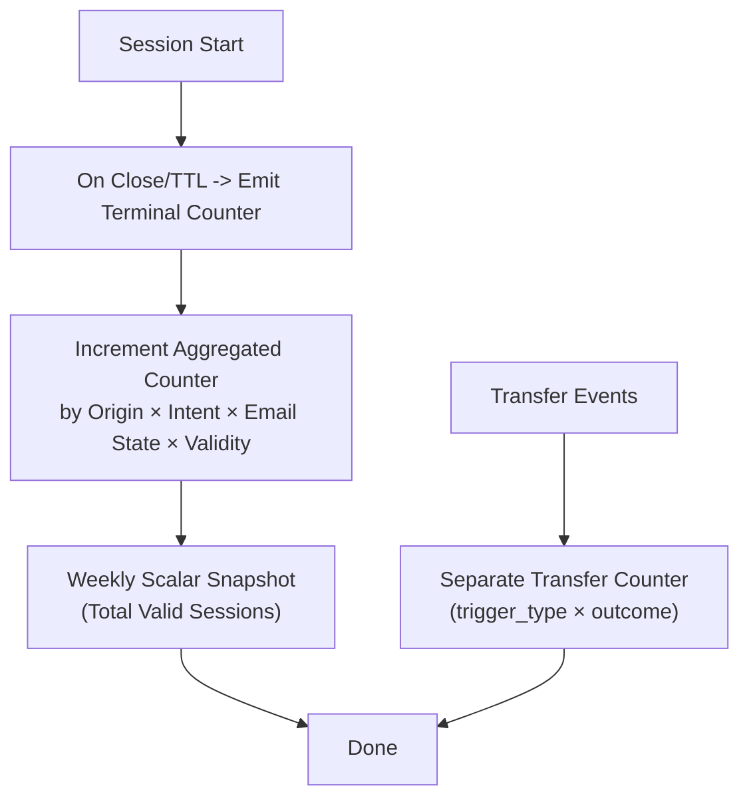

**Diagram sources**
- [DESIGN.md:127-166](file://.genie/brainstorms/plataforma-conversa-lead/DESIGN.md#L127-L166)
- [04-transfer-workflow.md:252-267](file://docs/sdd/04-transfer-workflow.md#L252-L267)

**Section sources**
- [DESIGN.md:127-166](file://.genie/brainstorms/plataforma-conversa-lead/DESIGN.md#L127-L166)

### Rate Limiting and Abuse Containment
- IP-based rate limit and per-session message cap protect the public LLM endpoint.
- Exceeded limits mark session validity as excluded (rate limit vs. message cap) and remove from N and rates.
- Blocked requests at the edge are counted as operational scalars by IP and day, not as sessions.

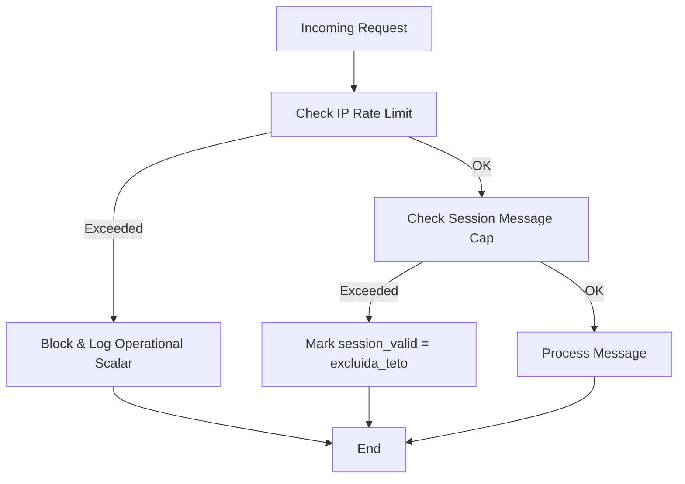

**Diagram sources**
- [DESIGN.md:112-116](file://.genie/brainstorms/plataforma-conversa-lead/DESIGN.md#L112-L116)
- [DESIGN.md:147-166](file://.genie/brainstorms/plataforma-conversa-lead/DESIGN.md#L147-L166)

**Section sources**
- [DESIGN.md:112-116](file://.genie/brainstorms/plataforma-conversa-lead/DESIGN.md#L112-L116)
- [DESIGN.md:147-166](file://.genie/brainstorms/plataforma-conversa-lead/DESIGN.md#L147-L166)

### LLM Integration Decisions
- Classifier is a single-purpose unit with explicit interface, testable against labeled messages.
- PII may transit to the LLM provider; policy requires zero retention and signed DPA before pilot.
- If tenant does not authorize corpus usage, synthetic data is admitted with declared limitations.

**Section sources**
- [DESIGN.md:225-233](file://.genie/brainstorms/plataforma-conversa-lead/DESIGN.md#L225-L233)
- [DESIGN.md:379-384](file://.genie/brainstorms/plataforma-conversa-lead/DESIGN.md#L379-L384)

### GDPR/LGPD Compliance
- Consent is the act of sending email, with restricted purpose limited to commercial return about this conversation; marketing consent is out of scope for this slice.
- Minimal data collection: no cookies for stitching, no persistent session history beyond TTL, no per-session timestamps in analytics.
- Manual runbook for access and deletion rights exists with named owner; exercised at least once in pilot environment.
- Email validation blocks disposable domains; no ownership verification to reduce friction.
- **Enhanced**: Audit logging for administrative actions ensures compliance tracking for backoffice operations.

**Section sources**
- [DESIGN.md:99-111](file://.genie/brainstorms/plataforma-conversa-lead/DESIGN.md#L99-L111)
- [DESIGN.md:107-116](file://.genie/brainstorms/plataforma-conversa-lead/DESIGN.md#L107-L116)
- [DESIGN.md:355-358](file://.genie/brainstorms/plataforma-conversa-lead/DESIGN.md#L355-L358)
- [DESIGN.md:438-440](file://.genie/brainstorms/plataforma-conversa-lead/DESIGN.md#L438-L440)
- [03-functional-spec-backoffice.md:263-281](file://docs/sdd/03-functional-spec-backoffice.md#L263-L281)

## Dependency Analysis
Enhanced component relationships with backoffice integration:
- Next.js depends on FastAPI for chat streaming and identification flows.
- FastAPI depends on PostgreSQL for ephemeral sessions, durable leads, aggregated counters, and backoffice data.
- FastAPI depends on LLM provider for intent classification.
- Analytics depend on session lifecycle events (close/TTL) to emit terminal counters.
- **Enhanced**: Backoffice depends on FastAPI APIs for operational data access with RBAC enforcement.
- **Enhanced**: Campaign configuration affects session creation and attribution tracking.
- **Enhanced**: Transfer configuration influences fallback behavior and conversation routing.

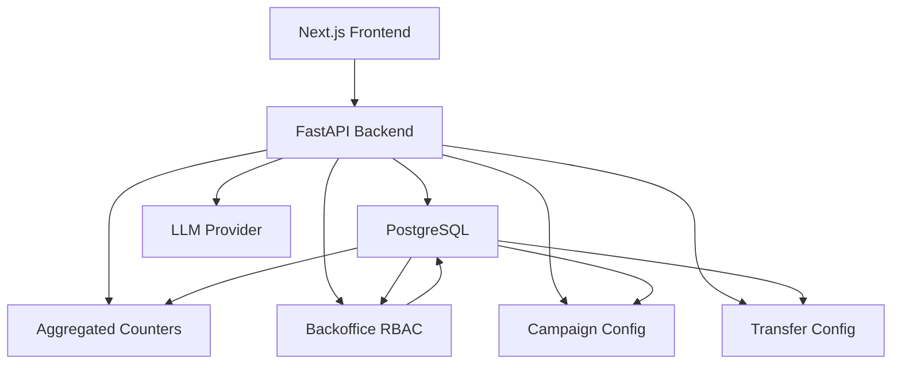

**Diagram sources**
- [DESIGN.md:190-214](file://.genie/brainstorms/plataforma-conversa-lead/DESIGN.md#L190-L214)
- [DESIGN.md:127-166](file://.genie/brainstorms/plataforma-conversa-lead/DESIGN.md#L127-L166)
- [03-functional-spec-backoffice.md:286-328](file://docs/sdd/03-functional-spec-backoffice.md#L286-L328)
- [05-campaign-management.md:226-252](file://docs/sdd/05-campaign-management.md#L226-L252)
- [04-transfer-workflow.md:20-58](file://docs/sdd/04-transfer-workflow.md#L20-L58)

**Section sources**
- [DESIGN.md:190-214](file://.genie/brainstorms/plataforma-conversa-lead/DESIGN.md#L190-L214)
- [DESIGN.md:127-166](file://.genie/brainstorms/plataforma-conversa-lead/DESIGN.md#L127-L166)

## Performance Considerations
- Postgres-only ephemeral sessions avoid extra operational services for pilot scale.
- Pre-aggregated counters minimize storage and query complexity while preserving denominators for metrics.
- Rate limiting and per-session caps protect LLM costs and availability under abuse.
- Weekly scalar snapshots reduce analytical overhead compared to per-session event logs.
- **Enhanced**: RBAC queries optimized for dashboard performance with indexed lookups.
- **Enhanced**: Campaign attribution uses efficient string matching for ?origem= parameters.
- **Enhanced**: Transfer configuration cached to minimize database queries during conversation flow.

[No sources needed since this section provides general guidance]

## Security & Compliance
**Enhanced** - Comprehensive security measures for RBAC and audit logging

The enhanced architecture includes robust security measures:

- **RBAC Implementation**: Role-based access control with JWT authentication, permission matrices, and resource-level authorization
- **Audit Logging**: Immutable audit trail for all administrative actions, parameter changes, and sensitive operations
- **Data Protection**: Segregation of operational data from customer-facing data with appropriate access controls
- **Compliance Framework**: Built-in support for LGPD requirements with audit trails and data governance tools

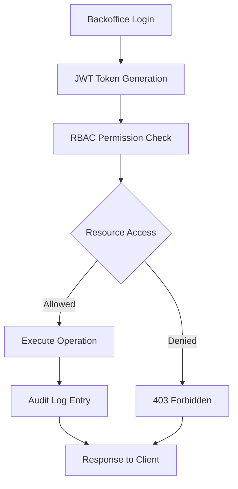

**Diagram sources**
- [03-functional-spec-backoffice.md:37-82](file://docs/sdd/03-functional-spec-backoffice.md#L37-L82)
- [03-functional-spec-backoffice.md:263-281](file://docs/sdd/03-functional-spec-backoffice.md#L263-L281)

**Section sources**
- [03-functional-spec-backoffice.md:37-82](file://docs/sdd/03-functional-spec-backoffice.md#L37-L82)
- [03-functional-spec-backoffice.md:263-281](file://docs/sdd/03-functional-spec-backoffice.md#L263-L281)

## Troubleshooting Guide
Common issues and mitigations:
- Classifier drift: monitor fallback rate as a production signal; maintain a validation set and thresholds.
- High abandonment due to email friction: ensure contextual timing and offer are present; validate email and block disposable domains.
- Overcounting or undercounting: verify terminal emissions occur for all sessions, including those excluded by rate limits or caps; reconcile email states with durable leads.
- Edge-blocked requests: ensure operational scalars are recorded separately from session counters.
- **Enhanced**: RBAC access issues: verify role assignments and permission matrices; check audit logs for failed access attempts.
- **Enhanced**: Campaign attribution problems: validate ?origem= parameter format; check campaign configuration status; verify link generation.
- **Enhanced**: Transfer workflow issues: confirm transfer configuration settings; check trigger conditions; verify transfer counter increments.

**Section sources**
- [DESIGN.md:376-399](file://.genie/brainstorms/plataforma-conversa-lead/DESIGN.md#L376-L399)
- [03-functional-spec-backoffice.md:263-281](file://docs/sdd/03-functional-spec-backoffice.md#L263-L281)
- [05-campaign-management.md:121-134](file://docs/sdd/05-campaign-management.md#L121-L134)
- [04-transfer-workflow.md:252-267](file://docs/sdd/04-transfer-workflow.md#L252-L267)

## Conclusion
The enhanced Sup Better Engine adopts a focused, privacy-first architecture that separates frontend, backend, and data concerns while proving the core premise: leads will engage via a dedicated link and convert to durable identities with minimal friction. The design emphasizes per-message routing, robust analytics without PII, strong compliance guardrails, and comprehensive operational oversight through the backoffice system.

The recent enhancements include a sophisticated RBAC system enabling multi-level operational access, structured campaign attribution tracking for precise marketing measurement, and a formalized transfer workflow with independent counting mechanisms. These additions provide the operational infrastructure necessary for pilot execution while maintaining the privacy-first approach and scalability considerations of the original design.

Future slices can add richer handlers, media, and multi-tenant features based on measured demand and pilot outcomes, building upon the solid foundation established by this enhanced architecture.

[No sources needed since this section summarizes without analyzing specific files]