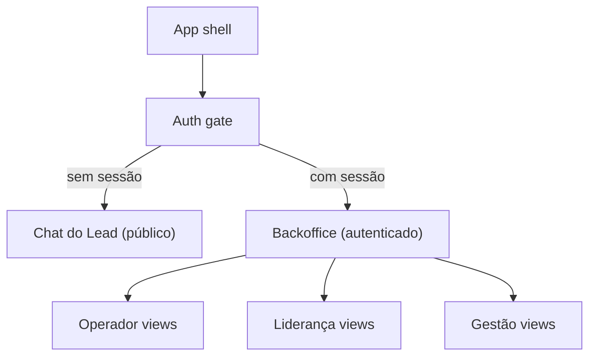

# Design System — Sup Better Engine

Spec visual e de UX da plataforma **Sup Better Engine** — interface conversacional para qualificação de leads + backoffice operacional.

Documento portátil: reimplemente o produto visual sem depender de bibliotecas específicas (shadcn, Capacitor, etc).

Fontes da verdade (repositório):

- `frontend/src/app/` — shell Next.js App Router
- `backend/app/api/` — endpoints de chat, auth
- `backend/app/handlers/` — handlers de qualificação e fallback
- `backend/app/services/` — classificador, lead_service, session_service
- `backend/app/models/` — modelos de dados (session, lead, campaign, transfer)
- `docs/sdd/` — especificações funcionais (atores, user stories, backoffice, transfer, campanhas)

Este arquivo documenta **UI/UX**. Negócio (RLS, HMAC, edge) fica de fora, salvo o mínimo para gate de acesso e confirmação de consentimento.

---

## 1. Princípio visual

Duas superfícies distintas. Não misturar.

| Superfície | Linguagem | Referência |
|---|---|---|
| Chat do lead (interface conversacional) | Conversacional / Warm | Canvas quente, compositor card, bolhas, empty state acolhedor |
| Backoffice (Operador, Liderança, Gestão) | Dashboard / Admin | Tabelas, cards de métrica, filtros, sidebar de navegação |

Regras:

- **Chat do lead**: sem sidebar, sem tabelas, sem menu de navegação. O chat **é** a interface.
- **Backoffice**: sem bolhas de chat, sem compositor pill, sem hero brand. Layout admin padrão.
- Ícones: Lucide (ou equivalente outline, stroke 1.5–2). Sem filled icons no chrome.
- Mobile-first no chat do lead; desktop-first no backoffice.

Headline canônica do chat (empty state):

> Como podemos ***ajudar você hoje?***

"ajudar você hoje?" é itálico + cor primary. O resto é regular/semibold, tracking-tight, sem caixa alta.

---

## 2. Tokens

Copie estas CSS variables. Todas as cores em HSL.

```css
:root {
  /* === Identidade Sup Better === */
  --sb-primary: 220 72% 56%;                /* #3B6FE8 — azul confiante */
  --sb-primary-foreground: 0 0% 100%;
  --sb-primary-hover: 220 72% 48%;
  --sb-accent: 152 56% 46%;                 /* #2EAD6A — verde sucesso/lead */
  --sb-accent-foreground: 0 0% 100%;

  /* === Superfícies === */
  --sb-canvas-chat: #f7f7f5;               /* fundo quente do chat (desktop) */
  --sb-canvas-backoffice: 220 14% 96%;     /* fundo neutro frio do backoffice */
  --sb-canvas-mobile: 220 14% 96%;

  /* === Texto === */
  --sb-fg: 220 12% 16%;
  --sb-fg-strong: 0 0% 9%;                 /* neutral-900 */
  --sb-muted: 220 10% 50%;
  --sb-muted-foreground: 220 10% 60%;

  /* === Bordas === */
  --sb-border: 220 16% 88%;
  --sb-border-desktop: rgba(229, 229, 229, 0.8);

  /* === Cards === */
  --sb-card: 0 0% 100%;
  --sb-bubble-user: 220 72% 56%;           /* primary */
  --sb-bubble-assistant: 0 0% 96%;         /* neutral-100 */
  --sb-consent-bg: 220 72% 96%;            /* primary/5 */
  --sb-consent-border: 220 72% 70%;        /* primary/30 */

  /* === Status === */
  --sb-success: 152 56% 46%;
  --sb-warning: 38 92% 50%;
  --sb-danger: 0 72% 51%;
  --sb-info: 200 80% 50%;

  /* === Raio === */
  --sb-radius-xl: 12px;
  --sb-radius-2xl: 16px;
  --sb-radius-composer: 28px;
  --sb-radius-hero: 32px;
  --sb-radius-pill: 9999px;

  /* === Misc === */
  --sb-touch: 44px;
  --sb-font-sans: "Inter", -apple-system, BlinkMacSystemFont, "Segoe UI", sans-serif;
  --sb-font-serif: ui-serif, Georgia, Cambodia, "Times New Roman", Times, serif;
}
```

Hex equivalentes úteis:

| Token | Hex |
|---|---|
| Primary | `#3B6FE8` |
| Accent | `#2EAD6A` |
| Canvas chat | `#F7F7F5` |
| Foreground | `#24293A` approx |
| Neutral 900 | `#171717` |
| Neutral 200 | `#E5E5E5` |
| Neutral 100 | `#F5F5F5` |
| Neutral 50 | `#FAFAFA` |

### Tipografia

| Papel | Família | Peso | Tamanho | Tracking | Cor |
|---|---|---|---|---|---|
| Título backoffice (sidebar, headers) | sans | 600 | 18–20px | tight | `#171717` |
| Hero chat empty state | sans | 600 | 28px → 36px (`md`) | tight | `#171717` + italic primary no destaque |
| Subtítulo / label seção | sans | 400 | 12px | — | muted |
| Body / bolha | sans | 400 | 14px | — | conforme papel |
| Input / textarea | sans | 400 | **16px** | — | foreground (16px evita zoom iOS) |
| Meta (tempo relativo) | sans | 400 | 12px | — | muted |
| Badge / KPI label | sans | 500 | 11px | wide, uppercase | muted |
| KPI valor | sans | 600 | 18px | — | `#171717` |
| Tabela header | sans | 500 | 12px | wide, uppercase | muted |
| Tabela cell | sans | 400 | 14px | — | foreground |

Body global: Inter. **Sem serif** — o projeto não usa a dualidade editorial/mobile do original. Headlines do chat usam sans bold.

### Espaço, raio, sombra, press

| Token | Valor |
|---|---|
| Page max width (backoffice) | `80rem` (`max-w-7xl`) |
| Padding page desktop | `16px` → `24px` (`md`), `py-24px` |
| Gap grid desktop | `24px`; sidebar `260px` + main |
| Chat max width | `48rem` (`max-w-3xl`) |
| Sombra card | `shadow-sm` (≈ `0 1px 2px rgb(0 0 0 / 0.05)`) |
| Sombra card hover | `shadow-md` |
| Press desktop | hover de cor; sem scale |
| Press mobile | `active:scale-[0.99]` (rows, tiles, cards) |
| Touch mínimo | 44×44px (`h-11` / `min-h-11`) |

### Ícones

| Contexto | Tamanho |
|---|---|
| Backoffice sidebar, tabs | 20px (`h-5 w-5`) |
| Chat chrome, send, mic | 16px (`h-4 w-4`) |
| Chat mobile, composer | 20px (`h-5 w-5`) |

Ícones usados: `MessageSquare`, `Users`, `BarChart3`, `Settings`, `Send`, `Mic`, `ArrowUp`, `Mail`, `Link`, `Copy`, `Download`, `Filter`, `Search`, `ChevronRight`, `ChevronDown`, `X`, `Plus`, `Clock`, `Shield`, `LogOut`, `Eye`, `EyeOff`, `Check`, `AlertTriangle`, `Sparkles`.

### Breakpoint e detecção

```
isMobileLayout = viewport width < 768
```

Sem detecção de app nativo nesta fase (fatia 1 é web-only).

---

## 3. Arquitetura de superfícies



### 3.1 Chat do Lead (interface pública)

Rota: `/c/[tenant_slug]` — acesso anônimo via link único.

O chat **é** a página. Não há header global, não há sidebar, não há navegação. O compositor e as bolhas preenchem a viewport.

Parâmetro `?origem=` capturado na entrada para atribuição de campanha.

### 3.2 Backoffice (interface autenticada)

Rota: `/backoffice/*` — acesso restrito a Operador, Liderança e Gestão.

Layout: sidebar fixa à esquerda (desktop) + drawer mobile (hamburger). Sidebar com logo, navegação por role, e avatar do usuário.

---

## 4. Chat do Lead — Layouts e estados

Quatro estados de tela.

### 4.1 Empty state (início da conversa)

Centralizado na viewport, máximo conforto visual.

**Desktop**

- Canvas `bg-[var(--sb-canvas-chat)]`, padding generoso (`py-80px`)
- Headline sans 28/36px, destaque italic primary: "Como podemos ***ajudar você hoje?***"
- Abaixo, 3 quick reply chips (ver §5.5)
- Compositor fixo na base (§5.3)

**Mobile**

- Hero brand no topo: `bg-primary` teal/blue, texto branco, `rounded-b-[2rem]`
- Título 22px bold branco
- Empty state abaixo: título centralizado `max-w-[16rem]`, 24px semibold, destaque italic primary
- Quick replies como rows full-width (sem borda, ícone + label)
- Compositor sticky no base (§5.4)

### 4.2 Conversa ativa

**Desktop**

- Bolhas dentro de `max-w-3xl`, centralizadas
- User: `ml-auto bg-primary text-white rounded-2xl`
- Assistant: `mr-auto bg-neutral-100 text-neutral-900 rounded-2xl`
- Loading: bolha assistant com texto "Pensando…" (sem skeleton, sem três pontos)
- Auto-scroll suave no fim da lista

**Mobile**

- Hero permanece no topo (shrink-0)
- Lista de mensagens: `flex-1 overflow-y-auto`, padding 16px
- Compositor sticky no base

### 4.3 Modal de email (consentimento)

Disparado após handler capturar intent/urgency/fit **ou** no turno 4 (o que vier primeiro). Máximo 2 exibições por sessão.

```
overlay: bg-black/40 backdrop-blur-sm
card: max-w-md rounded-2xl bg-white p-24 shadow-lg
```

Conteúdo:
- Ícone `Mail` 24px primary
- Título 18px semibold: "Para continuarmos…"
- Texto 14px: value proposition clara — "Seu e-mail serve para o time comercial retornar sobre esta conversa."
- Input email: `h-11 rounded-xl border px-16 text-16` (evita zoom iOS)
- Botão primário full-width: "Enviar e-mail" / "Enviando…"
- Link secundário: "Prefiro não informar" (registra `enviado_recusado`)
- Texto LGPD 11px muted: "Ao enviar, você concorda que seus dados serão usados apenas para este fim."

Validação:
- Sintaxe de email
- Blocklist de domínios descartáveis
- Erro inline abaixo do input (vermelho 12px)

### 4.4 Fim de conversa / fallback

Quando o classificador detecta intent não-qualificável:

- Bolha assistant com mensagem de fallback gracioso
- Aponta contato do tenant (telefone/email)
- **Não** finge capacidade
- Sessão permanece aberta (turn-terminal, não session-terminal)
- Se transfer configurado: mostra CTA de transferência (§5.10)

---

## 5. Catálogo de componentes — Chat do Lead

### 5.1 Composer desktop

Card único:

```
rounded-[28px]  border-neutral-200/80  bg-white  shadow-sm  overflow-hidden
```

Duas faixas internas:

1. **Transcript** — `min-h-[280px]` / `h-[min(42vh,420px)]`; em `md`: `min-h-[360px]` / `h-[min(52vh,560px)]`. Padding 16px, `space-y-12px`. Scroll interno.
2. **Input row** — `border-t border-neutral-100 bg-neutral-50/80 px-16 py-12`. Esquerda: textarea `min-h-[44px] rounded-2xl border-neutral-200 bg-white px-16 py-12 text-16`, sem ring no focus (`focus-visible:ring-0`). Direita: mic 44×44 `rounded-full` + Enviar.

**Enviar desktop:** `h-11 min-w-[120px] rounded-full px-24 gap-8px shadow-sm bg-primary text-white`. Label "Enviar" + `ArrowUp`. Disabled se loading ou input vazio.

**Mic desktop:** sempre visível. `rounded-full` + `shadow-md` + ícone `animate-pulse` enquanto grava.

### 5.2 Composer mobile

Faixa sticky:

```
border-t border-border/40
bg-background/95  backdrop-blur
px-12  pt-8
pb-[max(0.75rem, env(safe-area-inset-bottom))]
```

Linha `max-w-lg`, `items-end`, gap 8px:

**Pill** (`flex-1`, `min-h-12`, `rounded-full`, `border-border/60`, `bg-muted/40`, `px-6 py-4`)

- `<textarea rows={1}>` transparente, `min-h-10 max-h-28`, `text-16`, sem outline, `resize-none`
- Mic 40×40 **somente se o input está vazio**

**FAB** 48×48 `rounded-full shadow-sm bg-primary text-white` à direita:

| Estado | Ícone | Ação | Disabled |
|---|---|---|---|
| Há texto e não loading | `ArrowUp` | enviar | se loading |
| Sem texto, não gravando | `Mic` | iniciar voz | se loading |
| Sem texto, gravando | `Mic` pulse + `ring-2 ring-primary/40` | parar voz | se loading |

O mic **some do pill** quando há texto. O FAB assume o papel de enviar.

### 5.3 Message bubble

```
user:      ml-auto  w-fit  max-w-[min(100%,36rem)]  bg-primary  text-white
assistant: mr-auto  w-full  bg-neutral-100  text-neutral-900
thinking:  mr-auto  bg-muted  text-muted  italic
```

Bolha: `rounded-2xl px-16 py-10 text-14`.

Texto: `whitespace-pre-wrap break-words [overflow-wrap:anywhere]`.

**Loading:** bolha assistant com texto "Pensando…". Sem skeleton, sem três pontos animados.

User bubble **não** mostra avatar. Assistant **não** mostra avatar.

### 5.4 Quick replies (empty state)

Três itens contextuais:

| Label | Mensagem enviada |
|---|---|
| Quero saber mais | Gostaria de saber mais sobre os serviços |
| Tenho uma dúvida | Tenho uma dúvida para a equipe |
| Falar com atendente | Gostaria de falar com um atendente |

Desktop: chips outline `h-11 rounded-full border-primary/30 text-primary`, wrap, centro.

Mobile: rows com ícone, full-width, sem borda, 15px muted.

### 5.5 Quick replies (inline, no transcript)

`flex-wrap gap-8px`. Botões **secondary** (não outline) `h-11 rounded-full px-16`. Máximo 6.

### 5.6 Consent card (email coletado)

Após o lead enviar o email com sucesso:

```
rounded-2xl  border-accent/30  bg-accent/5  p-16
ícone Check 20px accent
título 14px semibold: "E-mail registrado"
resumo 12px neutral-700: "A equipe comercial entrará em contato em breve."
```

### 5.7 Transfer card (quando configurado)

Quando o fallback detecta transfer disponível:

```
rounded-2xl  border-primary/30  bg-primary/5  p-16
título 14px semibold: "Transferir para atendente"
resumo 12px neutral-700: descrição do destino (WhatsApp, telefone, etc.)
CTA: h-11 min-w-[120px] rounded-full bg-primary text-white "Transferir"
```

Se `mode = 'channel'`: CTA abre link externo (WhatsApp, tel, mailto).
Se `mode = 'none'`: não renderiza transfer card; mostra fallback com contato.

### 5.8 Choice list (qualificação)

Prompt 12px muted. Opções: botões outline `h-11 w-full justify-start rounded-xl`. Máximo 5. Clique envia a opção como mensagem do usuário.

Usado pelo handler de qualificação para perguntas estruturadas (necessidade, urgência, fit).

---

## 6. Backoffice — Layout e componentes

### 6.1 Shell do backoffice

```
┌──────────────────────────────────────────────────────────┐
│ Sidebar (260px)  │  Main content area                    │
│                  │                                       │
│ Logo             │  Header: breadcrumb + avatar + logout  │
│ ─────────       │                                       │
│ Nav items        │  [Content based on route/role]         │
│  - Sessões       │                                       │
│  - Leads         │                                       │
│  - Métricas      │                                       │
│  - Campanhas     │                                       │
│  - Configuração  │                                       │
│  - Auditoria     │                                       │
│ ─────────       │                                       │
│ User info        │                                       │
│ Logout           │                                       │
└──────────────────────────────────────────────────────────┘
```

**Sidebar**

- `w-[260px]` fixa, `bg-white border-r border-neutral-200`
- Logo: tile 40×40 `rounded-xl bg-primary/10` + nome "Sup Better" 16px semibold
- Nav items: `h-11 rounded-xl px-12 gap-12`, ícone 20px + label 14px
- Item ativo: `bg-primary/10 text-primary`
- Item inativo: `text-muted hover:bg-neutral-50 hover:text-foreground`
- Items visíveis dependem do **role** (RBAC):

| Nav item | Operador | Liderança | Gestão |
|---|:---:|:---:|:---:|
| Sessões ativas | ✅ | ✅ | ❌ |
| Leads | ✅ | ✅ | ✅ |
| Métricas diárias | ✅ | ✅ | ✅ |
| Métricas semanais/mensais | ❌ | ✅ | ✅ |
| Campanhas | ❌ | ✅ | ✅ |
| Configuração (parâmetros) | ❌ | ✅ | ✅ |
| Operadores (CRUD) | ❌ | ✅ | ✅ |
| Compliance | ❌ | ✅ | ✅ |
| Auditoria | ❌ | ✅ | ✅ |
| Tenant (contrato) | ❌ | ❌ | ✅ |

**Mobile:** sidebar vira drawer (overlay). Hamburger 44×44 no header.

### 6.2 Session Monitor (Operador / Liderança)

Rota: `/backoffice/sessions`

**Tabela responsiva:**

| Coluna | Tipo | Ordenável |
|---|---|:---:|
| Status | Badge colorido | ✅ |
| Intent | Badge texto | ✅ |
| Turnos | Número | ✅ |
| Tempo ativo | Duração relativa | ✅ (default desc) |
| Origem | Texto | ✅ |
| Email state | Badge | ✅ |
| Flagged | Ícone ⚑ | ✅ |
| Ações | Menu kebab | — |

**Badges de status:**

| Status | Cor | Badge |
|---|---|---|
| Ativa | `bg-green-100 text-green-800` | `● Ativa` |
| Idle | `bg-yellow-100 text-yellow-800` | `● Idle` |
| Expirada | `bg-neutral-100 text-neutral-600` | `● Expirada` |
| Rate limited | `bg-red-100 text-red-800` | `● Limitada` |

**Indicadores de limite:**
- 🟢 Verde: normal
- 🟡 Amarelo: > 50% do TTL ou turnos
- 🔴 Vermelho: > 80% do TTL ou turnos

**Filtros:** barra acima da tabela — dropdowns de intent, status, flagged. Busca por email/origem.

**Ações por linha:**
- Ver transcript (drawer lateral ou modal)
- Flag para revisão
- Adicionar nota interna

**Auto-refresh:** polling a cada 30s (configurável).

### 6.3 Lead Review (todos os roles backoffice)

Rota: `/backoffice/leads`

**Tabela:**

| Coluna | Tipo | Ordenável |
|---|---|:---:|
| Email | Texto (truncado) | ✅ |
| Intent | Badge | ✅ |
| Urgência | Badge | ✅ |
| Fit | Badge | ✅ |
| Origem | Texto | ✅ |
| Criado em | Data/hora | ✅ |
| Consentimento | Ícone ✅/❌ | ✅ |
| Ações | Menu kebab | — |

**Ações:**
- Ver detalhe (drawer com qualification output completo + histórico da sessão)
- Marcar como "contatado"
- Adicionar nota CRM
- Exportar selecionados (CSV)

**Export CSV:** botão toolbar `h-11 rounded-xl border gap-8` com `Download` + "Exportar CSV".

### 6.4 Métricas (dashboards)

#### 6.4.1 Métricas diárias (Operador)

Rota: `/backoffice/metrics`

**KPI cards** — grid 4 colunas desktop, 2 colunas mobile:

```
rounded-2xl  border  bg-white  p-16
label 11px uppercase tracking-wide muted
valor 24px semibold
delta 12px (verde ↑ / vermelho ↓ vs. dia anterior)
```

KPIs:
- Sessões hoje
- Sessões válidas hoje
- Leads identificados hoje
- Excluídas (rate/turn limit)

**Intent distribution** — barra horizontal ou donut chart.

**Email state distribution** — 4 segmentos: não pedido, pedido recusado, pedido aceito, (vazio).

#### 6.4.2 Métricas semanais/mensais (Liderança / Gestão)

- Trend lines: sessões, leads, taxa de conversão
- Semana atual vs anterior (% variação)
- Totais acumulados vs thresholds go/no-go

#### 6.4.3 Go/No-Go Evidence (Gestão)

Rota: `/backoffice/go-no-go`

Tabela de critérios:

| Critério | Target | Atual | Status | Tendência |
|---|---|---|---|---|
| R1: Adoção de leads | > 0% | X% | 🟢/🟡/🔴 | ↑/→/↓ |
| R2a: Sessões/semana | ≥ 17 | X | 🟢/🟡/🔴 | ↑/→/↓ |
| Acurácia classificador | Threshold por classe | X% | 🟢/🟡/🔴 | ↑/→/↓ |
| Custo por lead | < budget | R$ X | 🟢/🟡/🔴 | ↑/→/↓ |

Botão: "Exportar relatório (PDF)".

### 6.5 Campanhas (Liderança / Gestão)

Rota: `/backoffice/campaigns`

**Lista:**

| Coluna | Tipo |
|---|---|
| Nome | Texto |
| Origem | Badge código |
| Status | Badge (Ativo/Pausado/Arquivado) |
| Sessões | Número |
| Leads | Número |
| Conversão | % |
| Ações | Menu kebab |

**Ações por linha:**
- Copiar link (com toast de confirmação)
- Pausar / Reativar
- Arquivar
- Ver métricas (drill-down)

**Form de criação:**

```
card max-w-2xl rounded-2xl bg-white p-24
campos:
  Nome (text, required, max 100)
  Valor origem (text, required, max 50, alphanum+hyphens)
  TTL override (select, optional)
  Turn limit override (number, optional)
rodapé:
  Botão outline "Cancelar"
  Botão primary "Criar campanha"
```

Após salvar: exibir URL completa com botão copiar + QR code opcional.

### 6.6 Configuração de parâmetros (Liderança / Gestão)

Rota: `/backoffice/settings`

**Form de parâmetros:**

| Parâmetro | Input | Range |
|---|---|---|
| Session TTL | Select duration | 1h – 72h |
| Rate limit (IP/hour) | Number | 10 – 100 |
| Turn limit | Number | 10 – 100 |
| Turno de email modal | Number | 2 – 10 |
| Max exibições email modal | Number | 1 – 5 |

Cada alteração:
- Dialog de confirmação: "Alterar [parâmetro] de [antigo] para [novo]?"
- Campo "Motivo" obrigatório (text area)
- Log automático no audit trail

### 6.7 Gestão de operadores (Liderança / Gestão)

Rota: `/backoffice/operators`

**Lista:**

| Coluna | Tipo |
|---|---|
| Nome | Texto + avatar iniciais |
| Email | Texto |
| Role | Badge (Operador/Liderança/Gestão) |
| Status | Badge (Ativo/Inativo) |
| Último login | Tempo relativo |
| Ações | Menu kebab |

**Ações:**
- Convidar (email → senha temporária)
- Alterar role
- Desativar (preserva audit trail)

### 6.8 Compliance (Gestão / Liderança)

Rota: `/backoffice/compliance`

**Cards de resumo:**
- Total de leads com consentimento registrado
- Solicitações de exclusão: pendentes / cumpridas / atrasadas
- Conformidade de retenção de dados (TTL)

**Ações:**
- Exportar relatório (PDF/CSV)
- Ver fila de solicitações de exclusão

### 6.9 Audit Trail (Liderança / Gestão)

Rota: `/backoffice/audit`

Tabela:

| Coluna | Tipo |
|---|---|
| Timestamp | Data/hora |
| Ator | Nome + role |
| Evento | Badge tipo |
| Detalhes | Texto expansível |

Filtros: por ator, por tipo de evento, por range de datas.

Retenção: 24 meses, append-only.

---

## 7. UX, motion, a11y

### Teclado e envio (chat)

- Enter envia; Shift+Enter quebra linha.
- Send disabled se `!input.trim()` ou `loading`.
- Durante loading, input e mic ficam disabled.

### Placeholder typewriter (chat)

Texto completo:

> Ex.: quero saber mais, tenho uma dúvida, falar com atendente…

- 38 ms por caractere
- Ao terminar, espera 2500 ms e reinicia
- Se `prefers-reduced-motion: reduce`, mostra o texto inteiro de uma vez, sem loop

### Voz

- `SpeechRecognition` / `webkitSpeechRecognition`, `lang = "pt-BR"`
- `interimResults = false`, `continuous = false`, `maxAlternatives = 1`
- Transcript concatena no input (não envia sozinho)
- Ícone pulsa enquanto grava
- Sem suporte: toast pedindo Chrome/Edge
- Erros: `no-speech` (info), `not-allowed` / `audio-capture` / `network` (error). `aborted` silencioso

### Scroll

Âncora invisível no fim da lista. A cada mudança de `messages` ou `loading`:

```
bottomRef.scrollIntoView({ behavior: "smooth" })
```

### Toast / notificações

- Posição: `top-right` desktop, `top-center` mobile
- Duração: 3s (info/success), 5s (warning/error), sticky (error crítico)
- Variantes: success (accent), error (danger), info (primary), warning (warning)

### Confirm (backoffice)

Dialog padrão para ações destrutivas:

```
overlay: bg-black/40
card: max-w-md rounded-2xl bg-white p-24
título 18px semibold
descrição 14px neutral-700
footer: gap-12 justify-end
  Botão outline "Cancelar"
  Botão danger "Confirmar" / "Confirmando…"
```

### Texto longo

Sempre `break-words` + `overflow-wrap: anywhere` em bolhas. Truncate (`truncate`) em títulos de tabela, nomes, KPI.

### Foco e tap

- Alvos ≥ 44px
- Inputs mobile `font-size: 16px` (evita zoom iOS)
- `aria-label` em todos os icon-buttons
- Focus visible: `focus-visible:ring-2 focus-visible:ring-primary/40`

### Safe-area (mobile)

| Região | Padding |
|---|---|
| Hero chat mobile top | `pt-[max(env(safe-area-inset-top), 2.75rem)]` |
| Composer mobile bottom | `pb-[max(0.75rem, env(safe-area-inset-bottom))]` |

### Motion

- Transição de cor `transition-colors` em tabs, rows, buttons
- Sem page-transition, sem fade de mensagens
- Respeitar reduced-motion no typewriter
- Pulse só no mic ativo

---

## 8. Copy

### Chat do Lead

| Superfície | Texto |
|---|---|
| Hero empty | Como podemos *ajudar você hoje?* |
| Quick reply 1 | Quero saber mais |
| Quick reply 2 | Tenho uma dúvida |
| Quick reply 3 | Falar com atendente |
| Loading | Pensando… |
| Send | Enviar |
| Email modal título | Para continuarmos… |
| Email modal value prop | Seu e-mail serve para o time comercial retornar sobre esta conversa. |
| Email modal CTA | Enviar e-mail |
| Email modal skip | Prefiro não informar |
| Email modal LGPD | Ao enviar, você concorda que seus dados serão usados apenas para este fim. |
| Email success | E-mail registrado — a equipe comercial entrará em contato em breve. |
| Fallback (sem transfer) | Entendi. No momento, nossa equipe pode te ajudar pelo telefone ou email. |
| Transfer card | Transferir para atendente |
| Transfer busy | Transferindo… |
| Placeholder typewriter | Ex.: quero saber mais, tenho uma dúvida, falar com atendente… |
| Placeholder mobile fallback | Perguntar ao atendente |

### Backoffice

| Superfície | Texto |
|---|---|
| Sidebar logo | Sup Better |
| Nav: Sessões | Sessões |
| Nav: Leads | Leads |
| Nav: Métricas | Métricas |
| Nav: Campanhas | Campanhas |
| Nav: Configuração | Configuração |
| Nav: Auditoria | Auditoria |
| Nav: Compliance | Compliance |
| Session status: ativa | Ativa |
| Session status: idle | Idle |
| Session status: expired | Expirada |
| Session status: rate_limited | Limitada |
| Lead status: contacted | Contatado |
| Lead status: pending | Pendente |
| Campaign status: active | Ativo |
| Campaign status: paused | Pausado |
| Campaign status: archived | Arquivado |
| Export CSV | Exportar CSV |
| Confirm dialog | Confirmar |
| Cancel dialog | Cancelar |
| Parameter change reason | Motivo da alteração |

Tom: profissional, direto, sem emoji no chrome. Status em português com inicial maiúscula (`Ativa`, `Em andamento`, `Concluído`).

---

## 9. Do / Don't

**Do**

- Chat do lead = interface pura e focada; sem sidebar, sem tabelas
- Backoffice = layout admin padrão com sidebar + tabelas + filtros
- Bolha user primary; assistant cinza neutro; consent com wash accent (verde)
- Touch 44px, texto de input 16px, safe-area no hero e no composer
- RBAC visível: nav items aparecem/desaparecem por role
- Toast para feedback de ações (copiar link, exportar, salvar)
- Dialog de confirmação para toda ação destrutiva no backoffice
- Respeitar reduced-motion no typewriter

**Don't**

- Não misturar linguagens: chat não tem elementos de admin, backoffice não tem bolhas
- Não usar serif em nenhum lugar (diferente do original "Minha Gestora")
- Não mostrar avatar nas bolhas do chat
- Não renderizar HTML do modelo (whitelist de blocks/cards)
- Não executar write no mesmo turno do texto (sempre consent/confirm)
- Não paginar o transcript do chat
- Não usar pills `rounded-full` para tabs no backoffice (usar underline ou sidebar highlight)
- Não expor dados sensíveis (email completo) na tabela sem máscara — considerar `a***@email.com`

---

## 10. Checklist para implementação

**Fundação**

- [ ] Tokens de cor/raio/tipo copiados (primary `#3B6FE8`, accent `#2EAD6A`, Inter)
- [ ] Split chat (público) vs backoffice (autenticado)
- [ ] RBAC: nav items filtrados por role (Operador, Liderança, Gestão)
- [ ] Auth gate: sem sessão → chat; com sessão → backoffice

**Chat do Lead**

- [ ] Empty state (headline + quick replies)
- [ ] Composer desktop (card 28px com transcript + input)
- [ ] Composer mobile (pill + FAB 48px)
- [ ] Bolhas user/assistant/thinking
- [ ] Modal de email com validação + consentimento LGPD
- [ ] Fallback handler com contato do tenant
- [ ] Transfer card (quando configurado)
- [ ] Typewriter 38ms / loop 2.5s / reduced-motion
- [ ] Voz pt-BR; pulse enquanto grava
- [ ] `overflow-wrap: anywhere`
- [ ] Auto-scroll suave
- [ ] Choice list (qualificação estruturada)

**Backoffice**

- [ ] Sidebar 260px com nav por role
- [ ] Session Monitor (tabela + filtros + badges + indicadores de limite)
- [ ] Lead Review (tabela + detalhe + export CSV)
- [ ] Métricas diárias (KPI cards + distribuição)
- [ ] Métricas semanais/mensais (Liderança)
- [ ] Go/No-Go panel (Gestão)
- [ ] Campanhas (lista + criação + copiar link)
- [ ] Configuração de parâmetros (com confirmação + motivo)
- [ ] Gestão de operadores (convite + role + desativação)
- [ ] Compliance overview (Gestão)
- [ ] Audit trail (tabela + filtros)

**A11y / Mobile**

- [ ] Alvos ≥ 44px
- [ ] Input `16px` no chat mobile
- [ ] `aria-label` nos icon-buttons
- [ ] Safe-area top no hero, bottom no composer
- [ ] Focus visible ring em todos os interativos
- [ ] Sidebar drawer no mobile

---

## 11. Mapa rápido de medidas

| Peça | Medida |
|---|---|
| Breakpoint mobile/desktop | 768px |
| Sidebar backoffice | 260px |
| Page max (backoffice) | 1280px (`max-w-7xl`) |
| Chat max | 768px (`max-w-3xl`) |
| Hero chat mobile | 28→36px sans |
| Icon button (chat) | 44×44 |
| FAB mobile | 48×48 |
| Tab / chip / send | altura 44px |
| Textarea desktop | min 44px, radius 16px |
| Composer card | radius 28px |
| Hero mobile | radius inferior 32px |
| KPI card min width | 152px (`9.5rem`) |
| Session monitor auto-refresh | 30s |
| Audit retention | 24 meses |
| Email modal max displays | 2 / sessão |
| Turno email trigger | 4 (configurável) |
| Typewriter | 38ms, pause 2500ms |
| Max quick replies inline | 6 |
| Max choice options | 5 |
